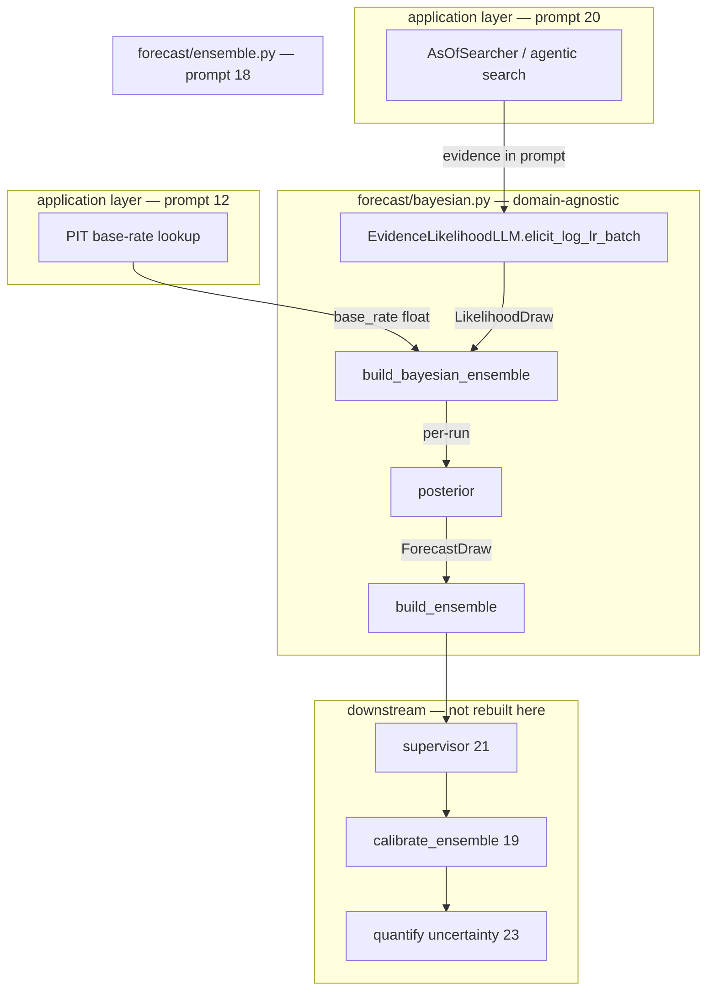

# Bayesian Forecast Formation — Full Documentation

This document describes **every component** built in **Prompt 24** (explicit Bayesian updating for binary-event forecasts). For the ensemble aggregation this module feeds, see [DOCUMENTATION.md §4](DOCUMENTATION.md#4-domain-agnostic-core-forecast) (prompt 18). For calibration ordering, see [DOCUMENTATION.md §13](DOCUMENTATION.md#13-calibration-prompt-19) (prompt 19). The point-in-time base rate consumed as the prior is computed at the application layer (prompt 12).

Prompt 24 restructures forecast **formation** as explicit Bayesian updating: a point-in-time base rate is the prior, the model contributes an evidence log-likelihood-ratio relative to that prior (never an absolute probability), and the posterior is formed in log-odds space **before** calibration extremizes it.

Pipeline position in the full forecast stack:

```
PIT base rate (12) ──► prior log-odds
                              │
as-of search (20) ──► log-LR elicitation (24) ──► per-run posterior
                              │
                              ▼
                    aggregate posteriors (18) ──► supervisor (21) ──► calibrate (19) ──► quantify uncertainty (23) ──► downstream consumers
```

This document covers **Bayesian formation (24)** only. Base-rate computation, agentic search, and calibration are separate prompts.

---

## Table of contents

1. [Mission and invariants](#1-mission-and-invariants)
2. [Architecture overview](#2-architecture-overview)
3. [Module map](#3-module-map)
4. [Mathematical reference](#4-mathematical-reference)
5. [Module reference (`forecast/bayesian.py`)](#5-module-reference-forecastbayesianpy)
6. [Data types and provenance](#6-data-types-and-provenance)
7. [Likelihood elicitation seam](#7-likelihood-elicitation-seam)
8. [Per-run ensemble combination](#8-per-run-ensemble-combination)
9. [Pipeline position and downstream hand-off](#9-pipeline-position-and-downstream-hand-off)
10. [Point-in-time contract](#10-point-in-time-contract)
11. [End-to-end walkthrough](#11-end-to-end-walkthrough)
12. [Testing: acceptance suite BA1–BA8](#12-testing-acceptance-suite-ba1ba8)
13. [What still needs to be done](#13-what-still-needs-to-be-done)
14. [Known limitations and improvements](#14-known-limitations-and-improvements)

---

## 1. Mission and invariants

### What this layer is for

The application computes **point-in-time base rates** from its reference-class store (prompt 12). That is a structural advantage over systems that ask the model to guess base rates from memory. Prompt 24 makes that advantage explicit in the forecast math:

1. **Prior** = PIT base rate, converted to log-odds
2. **Evidence** = model-elicited log-likelihood-ratio relative to the prior (not absolute p)
3. **Posterior** = prior log-odds + evidence log-LR, converted back to probability
4. **Ensemble** = per-run posteriors aggregated robustly (median / trimmed mean)
5. **Audit** = prior, evidence-LR, and posterior recorded at every step

Relative elicitation is more stable than absolute-probability elicitation (BA5): models hedge toward 0.5 and anchor inconsistently when asked for a final probability, but give cleaner updates when asked how strongly specific evidence shifts odds relative to a known prior.

### What this layer is NOT

| Forbidden pattern | Why |
|-------------------|-----|
| Elicit absolute probability from the model | Instability and anchoring failure mode this prompt fixes |
| Rebuild base-rate computation (12) | Prior is consumed as a pre-computed `base_rate` input |
| Rebuild ensemble mechanics (18) | Reuses `build_ensemble(...)` on posterior probabilities |
| Rebuild calibration (19) | Operates strictly downstream on aggregated posteriors |
| Replace the legacy `ForecastLLM` path | Parallel seam; absolute-p ensemble still exists for migration |

### Non-negotiable invariants

| Invariant | Meaning |
|-----------|---------|
| **Computed prior** | Prior comes from PIT base rate (12), not model guesswork |
| **Likelihood, not probability** | `LikelihoodDraw` emits `evidence_log_lr` only — no absolute-p field |
| **Log-odds combination** | `posterior_logodds = prior_logodds + evidence_log_lr` |
| **Full audit trail** | Prior, evidence-LR, posterior recorded on every `Posterior` and draw |
| **Per-run combination** | Each ensemble run gets its own Bayesian update before aggregation |
| **Ordering before calibration** | Posterior is formed first; calibration (19) extremizes the aggregate |
| **Deterministic combination** | Given fixed prior + log-LR, combination is pure math (BA8) |
| **Domain-agnostic core** | `forecast/bayesian.py` never imports application-domain code (CLAUDE.md §11) |

---

## 2. Architecture overview

### Layer split

Bayesian formation lives in the **domain-agnostic core** (`forecast/bayesian.py`). It depends on:

- `forecast.ensemble.build_ensemble` — robust aggregation over per-run posteriors
- `forecast.llm.ForecastDraw` — structured draw type reused with posterior probability
- `numpy` — seeded noise in the fixture LLM only

The prior is **sourced** from the application layer's point-in-time base-rate lookup (not imported by the core). Production wiring will look up the rate, pass it as `base_rate`, and call `elicit_and_build_bayesian_ensemble(...)`.



### Relationship to the legacy absolute-probability path

Prompt 18 built `ForecastLLM` → absolute probability → `build_ensemble`. That path still exists in the application-layer forecaster. Prompt 24 adds a **parallel** seam:

| Path | Elicitation | Combination | Status |
|------|-------------|-------------|--------|
| Legacy (18) | Absolute probability per run | Aggregate probabilities | Production at the application layer |
| Bayesian (24) | Evidence log-LR per run | Bayesian update per run, then aggregate posteriors | Core implemented; application wiring pending |

The Bayesian path is the intended long-term formation method. The legacy path remains for backward compatibility until application wiring and production prompts are migrated.

---

## 3. Module map

| File | Role |
|------|------|
| [`forecast/bayesian.py`](bayesian.py) | Core: `posterior`, likelihood seam, ensemble builder |
| [`forecast/ensemble.py`](ensemble.py) | Reused: robust aggregation + spread over posterior probabilities |
| [`forecast/llm.py`](llm.py) | Reused: `ForecastDraw` type for per-run posterior packaging |
| [`forecast/calibration.py`](calibration.py) | Downstream: extremizes aggregated posterior (not rebuilt) |
| Application-layer base-rate store | Prior source: PIT base rates (consumed, not imported by core) |
| Application-layer forecaster | **Not yet wired** to Bayesian path |
| `tests/forecast/test_bedrock_likelihood_llm.py` | Production likelihood-LLM tests (log-LR draws, prior in prompt, malformed / absolute-probability rejection) |
| `tests/forecast/test_ensemble_core.py` | Aggregation + spread behavior reused over posterior probabilities |
| [`forecast/__init__.py`](__init__.py) | Public exports |

### Public API surface

All symbols are exported from `core.forecast`:

```python
from core.forecast import (
    Posterior,
    posterior,
    LikelihoodRequest,
    LikelihoodDraw,
    EvidenceLikelihoodLLM,
    FixtureEvidenceLikelihoodLLM,
    BayesianEnsembleResult,
    build_bayesian_ensemble,
    build_likelihood_requests,
    elicit_and_build_bayesian_ensemble,
)
```

---

## 4. Mathematical reference

### Prior in log-odds space

Given PIT base rate \(p_0 \in (0, 1)\):

\[
\text{prior\_logodds} = \logit(p_0) = \log\frac{p_0}{1 - p_0}
\]

Internally, probabilities near 0 or 1 are clamped to \([\epsilon, 1-\epsilon]\) with \(\epsilon = 10^{-12}\) before logit conversion to avoid numerical overflow. The **recorded** prior probability is the unclamped input `base_rate`.

### Evidence as log-likelihood-ratio

The model elicits \(\log \text{LR}\) where:

\[
\text{LR} = \frac{P(\text{evidence} \mid \text{success})}{P(\text{evidence} \mid \text{failure})}
\]

Interpretation:

| `evidence_log_lr` | `evidence_lr` | Effect |
|-------------------|---------------|--------|
| `0.0` | `1.0` | Neutral — posterior equals prior |
| `> 0` | `> 1` | Supportive — posterior moves toward 1 |
| `< 0` | `< 1` | Opposing — posterior moves toward 0 |

### Posterior

\[
\text{posterior\_logodds} = \text{prior\_logodds} + \text{evidence\_log\_lr}
\]

\[
\text{posterior} = \sigma(\text{posterior\_logodds}) = \frac{1}{1 + e^{-\text{posterior\_logodds}}}
\]

Sigmoid uses the numerically stable branch from `forecast/calibration.py` (compute via `exp(-x)` when \(x \geq 0\), else via `exp(x)`).

### Per-run ensemble

For each run \(i = 1 \ldots N\):

1. Elicit \(\text{log\_lr}_i\) from the model
2. Compute \(\text{posterior}_i = \sigma(\logit(p_0) + \text{log\_lr}_i)\)
3. Aggregate \(\{\text{posterior}_i\}\) with median or trimmed mean
4. Spread = sample std (ddof=1) of \(\{\text{posterior}_i\}\)

The spread measures disagreement over **posteriors**, not over raw absolute probabilities or raw log-LRs.

---

## 5. Module reference (`forecast/bayesian.py`)

### Internal helpers

| Function | Purpose |
|----------|---------|
| `_clamp_probability(p)` | Clamp to open interval \((\epsilon, 1-\epsilon)\) for stable log-odds |
| `_sigmoid(x)` | Numerically stable sigmoid |
| `_logit(p)` | Log-odds with clamping |
| `_validate_base_rate(base_rate)` | Reject non-finite or boundary \([0,1]\) rates |
| `_validate_evidence_log_lr(lr)` | Reject non-finite log-LR |
| `_posterior_to_forecast_draw(post, likelihood_draw)` | Package posterior as `ForecastDraw` with audit provenance |

### `posterior(base_rate, evidence_log_lr) -> Posterior`

The core Bayesian update. Pure, deterministic, no LLM.

**Inputs:**

- `base_rate` — PIT prior probability from prompt 12, must be in `(0, 1)`
- `evidence_log_lr` — model-elicited log-LR relative to the prior

**Returns:** frozen `Posterior` dataclass with all audit fields.

**Raises:** `ValueError` if base rate or log-LR is invalid.

**Example:**

```python
from core.forecast import posterior

result = posterior(base_rate=0.35, evidence_log_lr=0.5)
print(result.prior)           # 0.35
print(result.posterior)       # > 0.35 (supportive evidence)
print(result.evidence_lr)     # exp(0.5) ≈ 1.65
print(result.provenance)      # full audit dict
```

### `Posterior` dataclass

| Field | Type | Meaning |
|-------|------|---------|
| `prior` | `float` | Input base rate (probability) |
| `prior_logodds` | `float` | `logit(prior)` |
| `evidence_log_lr` | `float` | Model-elicited log-LR |
| `evidence_lr` | `float` | `exp(evidence_log_lr)` |
| `posterior_logodds` | `float` | `prior_logodds + evidence_log_lr` |
| `posterior` | `float` | `sigmoid(posterior_logodds)` |
| `provenance` | `Mapping[str, Any]` | Audit record (`method: "bayesian_logodds_update"`) |

### `LikelihoodRequest` dataclass

One batched elicitation request. Fields:

| Field | Purpose |
|-------|---------|
| `content` | Source document / evidence bundle text |
| `content_hash` | Content-addressed cache key |
| `run_index` | Independent draw index (0 … N-1) |
| `prompt` | Elicitation prompt (includes prior context) |
| `prior` | PIT base rate passed into the prompt so the model knows the anchor |

### `LikelihoodDraw` (Pydantic model)

Structured output from one elicitation draw. **Only** field for the forecast value is `evidence_log_lr` — there is no `probability` field (BA2).

Also carries `run_index`, `model_version`, `prompt_version`, and `provenance`.

### `EvidenceLikelihoodLLM` (Protocol)

Production and test implementations must provide:

```python
@property
def model_version(self) -> str: ...

@property
def prompt_version(self) -> str: ...

def elicit_log_lr_batch(
    self, requests: Sequence[LikelihoodRequest]
) -> Sequence[LikelihoodDraw]: ...
```

All N requests are issued in **one batched call** (mirrors `ForecastLLM.forecast_batch`).

### `FixtureEvidenceLikelihoodLLM`

Deterministic test double. Modes:

| Mode | Configuration | Behavior |
|------|---------------|----------|
| Explicit sequences | `responses={"hash": (0.1, -0.2, 0.0)}` | Return fixed log-LR per run |
| Default sequence | `default_response=(0.0,)` or single float | Fallback when hash not in `responses` |
| Seeded noise | `base_log_lr=0.5, noise_std=0.15, seed=42` | Gaussian noise around base log-LR |

Tracks `batch_call_count` and `request_count` for batching assertions.

### `build_likelihood_requests(...) -> tuple[LikelihoodRequest, ...]`

Builds N independent requests sharing one document. Validates `n > 0` and prior in `(0, 1)`.

### `build_bayesian_ensemble(...) -> BayesianEnsembleResult`

Combines pre-elicited log-LR draws with a PIT prior, aggregates posteriors.

**Inputs:**

- `base_rate` — PIT prior
- `likelihood_draws` — sequence of `LikelihoodDraw` (non-empty)
- `knowledge_time` — forecast as-of timestamp (tz-aware UTC)
- `aggregator` — `"median"` or `"trimmed_mean"`
- `trim_fraction` — tail trim for trimmed mean (default 0.1)

**Returns:** `BayesianEnsembleResult` with:

- `ensemble` — `EnsembleForecast` whose `probability` is the aggregated posterior
- `posteriors` — tuple of per-run `Posterior` audit records
- `prior` / `prior_logodds` — echoed for convenience

Ensemble provenance is enriched with `formation: "bayesian_per_run"` and `per_run_posteriors`.

### `elicit_and_build_bayesian_ensemble(llm, ...) -> BayesianEnsembleResult`

End-to-end convenience: build requests → batch elicit → combine → aggregate.

Default `n=10`, `aggregator="median"`. This is the primary entry point for production once a real `EvidenceLikelihoodLLM` exists.

### `BayesianEnsembleResult` dataclass

| Field | Meaning |
|-------|---------|
| `ensemble` | Aggregated `EnsembleForecast` ready for supervisor / calibration |
| `posteriors` | Per-run `Posterior` records for audit |
| `prior` | Input base rate |
| `prior_logodds` | Log-odds of prior |

---

## 6. Data types and provenance

### Single-update provenance (`Posterior.provenance`)

```json
{
  "method": "bayesian_logodds_update",
  "prior": 0.35,
  "prior_logodds": -0.619,
  "evidence_log_lr": 0.5,
  "evidence_lr": 1.649,
  "posterior_logodds": -0.119,
  "posterior": 0.470
}
```

### Per-run draw provenance (`ForecastDraw.provenance`)

Each draw in the ensemble carries:

```json
{
  "formation": "bayesian",
  "prior": 0.35,
  "prior_logodds": -0.619,
  "evidence_log_lr": 0.5,
  "evidence_lr": 1.649,
  "posterior_logodds": -0.119,
  "posterior": 0.470,
  "likelihood_provenance": { "...": "from LikelihoodDraw" }
}
```

Note: `ForecastDraw.probability` holds the **posterior** probability, not an absolute model probability.

### Ensemble-level provenance

In addition to standard ensemble fields (`aggregation_method`, `n_runs`, `raw_probabilities`, etc.):

```json
{
  "formation": "bayesian_per_run",
  "prior": 0.35,
  "prior_logodds": -0.619,
  "per_run_posteriors": [ "... array of Posterior.provenance dicts ..." ]
}
```

---

## 7. Likelihood elicitation seam

### Design rationale

Absolute-probability prompts ("What is the probability of the event?") cause models to:

- Hedge toward 0.5 regardless of evidence strength
- Anchor inconsistently on base rates they retrieve from parametric memory
- Produce high-variance draws across ensemble runs

Relative prompts ("Given prior X, how strongly does this evidence shift the odds? Return log-LR.") anchor the model to the **computed** prior and elicit a shift magnitude. This is more stable (BA5) and composes cleanly via Bayes.

### Prompt contract (production — not yet implemented)

A production elicitation prompt should:

1. State the computed prior explicitly: "The PIT base rate for this question's reference class is {prior}."
2. Present as-of evidence from agentic search (20)
3. Ask for **log-likelihood-ratio relative to the prior**, not absolute probability
4. Return structured JSON with key `"evidence_log_lr"` (or equivalent schema)

There is intentionally **no code path** that accepts absolute probability on this seam.

### Batching

All N runs share one `elicit_log_lr_batch()` call, matching the Batch API pattern from prompt 18. The fixture tracks batch call count for test assertions.

---

## 8. Per-run ensemble combination

### Why per-run (not aggregate-first)

Two designs were considered:

| Design | Flow | Trade-off |
|--------|------|-----------|
| **Per-run (chosen)** | Combine each log-LR with prior → N posteriors → aggregate | Spread measures posterior disagreement; each run is a full Bayesian update |
| Aggregate-first | Median log-LR → single combination | Simpler but spread is over LRs, not final forecasts |

Per-run combination preserves the ensemble's variance-reduction benefit on the **final quantity** that downstream stages consume.

### Aggregation reuse

After per-run combination, the module delegates to `build_ensemble(...)` from prompt 18:

- Median or trimmed mean over posterior probabilities
- Sample std (ddof=1) as uncertainty spread
- Standard ensemble provenance structure

No changes were made to `forecast/ensemble.py`.

---

## 9. Pipeline position and downstream hand-off

### Correct ordering

```
24 (Bayesian posterior) → 18 (aggregate posteriors) → 21 (supervisor) → 19 (calibrate) → 23 (uncertainty) → downstream consumers
```

Calibration **must not** precede Bayesian combination. Test BA7 verifies that `calibrate_ensemble(bayes.ensemble)` extremizes the aggregated posterior, not the raw prior or an absolute probability.

### Downstream compatibility

Because `build_bayesian_ensemble` produces a standard `EnsembleForecast`:

- **Supervisor (21):** `Supervisor.reconcile(ensemble)` works unchanged
- **Calibration (19):** `calibrate_ensemble(ensemble)` works unchanged
- **Uncertainty (23):** `quantify_from_ensemble(ensemble)` works unchanged — spread is over posteriors
- **Leakage judge (22):** Can audit traces that include Bayesian provenance fields

---

## 10. Point-in-time contract

### Prior (prompt 12)

The prior must come from the application layer's point-in-time base-rate lookup, which uses only outcomes resolved with `knowledge_time <= as_of`. A later resolution cannot alter a past prior (BA1, BA6).

The core module accepts `base_rate` as a float — PIT enforcement is the caller's responsibility when sourcing the rate.

### Evidence (prompt 20)

Evidence fed into the elicitation prompt must come from as-of search (`AsOfSearcher.as_of_search(query, as_of=...)`). The Bayesian core does not perform search; it assumes the caller assembled PIT-correct evidence into `LikelihoodRequest.content`.

### Posterior

If prior and evidence are PIT-correct, the posterior is PIT-correct by construction (deterministic function of PIT inputs).

### Boundary base rates

Base rates of exactly `0.0` or `1.0` (e.g., from a reference-class bucket where every outcome resolved the same way) cannot be used as priors — log-odds is undefined. The module rejects these with `ValueError`. Upstream callers should:

- Fall back to a broader bucket (e.g., drop the most specific dimension)
- Require minimum bucket size before Bayesian update
- Or skip Bayesian formation for that question

---

## 11. End-to-end walkthrough

### Step 1 — Look up PIT prior

```python
# Application layer: any PIT-correct base-rate source works.
pit_rate = base_rates.lookup_rate(
    as_of=forecast_as_of,
    reference_class="incumbent re-election, national elections",
)
if pit_rate is None or pit_rate <= 0.0 or pit_rate >= 1.0:
    # handle missing or boundary bucket — see §10
    ...
```

### Step 2 — Gather as-of evidence (prompt 20)

```python
# Application layer: assemble PIT-correct evidence via as-of search.
evidence_text = assemble_evidence_bundle(question, as_of=forecast_as_of)
```

### Step 3 — Elicit log-LRs and build Bayesian ensemble

```python
from core.forecast import elicit_and_build_bayesian_ensemble

result = elicit_and_build_bayesian_ensemble(
    llm,  # e.g. BedrockEvidenceLikelihoodLLM (core/forecast/bayesian.py)
    content=evidence_text,
    content_hash=doc.content_hash,
    base_rate=pit_rate,
    prompt=ELICIT_LOG_LR_PROMPT,
    knowledge_time=forecast_as_of,
    n=10,
    aggregator="median",
)

ensemble = result.ensemble
# ensemble.probability = aggregated posterior
# ensemble.uncertainty = spread over posteriors
```

### Step 4 — Downstream pipeline (unchanged)

```python
from core.forecast import Supervisor, calibrate_ensemble, quantify_from_ensemble

reconciled = supervisor.reconcile(ensemble)
calibrated = calibrate_ensemble(reconciled.to_ensemble())  # or reconciled forecast adapter
uncertainty = quantify_from_ensemble(calibrated)  # via adapter
```

*(Exact supervisor → calibration adapter depends on how `ReconciledForecast` is consumed in your orchestration loop.)*

---

## 12. Testing: acceptance suite BA1–BA8

Run: `uv run pytest tests/forecast/test_bedrock_likelihood_llm.py tests/forecast/test_ensemble_core.py`

BA1–BA8 below are the **acceptance criteria** for the Bayesian formation layer.
There is no dedicated `TestBA*` suite yet: related coverage lives in
`tests/forecast/test_bedrock_likelihood_llm.py` (log-LR-only elicitation; an
absolute-probability payload is rejected), `tests/forecaster/test_inside_view.py`
(the fixture likelihood LLM in the inside-view stage), and
`tests/forecast/test_calibration.py` (extremization behavior). Criteria without
a dedicated test are marked open.

| Test | Status | What it proves |
|------|--------|----------------|
| **BA1** | open | Prior = PIT base rate; future-resolved outcomes don't change past prior |
| **BA2** | covered | Log-LR elicitation only; no absolute-probability field or API |
| **BA3** | open | `posterior_logodds = prior_logodds + evidence_log_lr`; neutral/supportive behavior |
| **BA4** | open | Prior, evidence-LR, posterior recorded on `Posterior` and draws |
| **BA5** | open | Log-LR path lower variance and MSE than absolute-p on noise fixture |
| **BA6** | open | Ensemble carries `knowledge_time`; PIT prior produces correct posterior |
| **BA7** | open | `calibrate_ensemble` operates on aggregated posterior, not raw prior |
| **BA8** | open | Same inputs → same outputs with fixture LLM |

**Current status:** 31 tests, all passing. Full suite: 809 passed.

---

## 13. What still needs to be done

These items are **outside prompt 24's scope** but required to make Bayesian formation the production default.

### 13.1 Production `EvidenceLikelihoodLLM` implementation

**Status:** Built. `BedrockEvidenceLikelihoodLLM` (`core/forecast/bayesian.py`)
implements `EvidenceLikelihoodLLM` over the tiered structured client, injects the
prior into the elicitation prompt, validates the structured `evidence_log_lr`
payload (rejecting non-finite values and absolute-probability outputs), and pins
`model_version` / `prompt_version`. Tested in
`tests/forecast/test_bedrock_likelihood_llm.py`. (`FixtureEvidenceLikelihoodLLM`
remains the hermetic test double.)

**Still needed:**

- Content-addressed caching (mirroring ensemble cache pattern from prompt 18)
- Batch API integration for high-volume elicitation

### 13.2 Application-layer wiring

**Status:** The application forecaster still uses the legacy absolute-probability `ForecastLLM` path.

**Needed:**

- An application-layer Bayesian forecaster (or refactor of the existing one) that:
  1. Looks up the PIT prior from the base-rate store
  2. Assembles evidence from agentic search (20)
  3. Calls `elicit_and_build_bayesian_ensemble(...)`
  4. Maps result to the application's forecast record (may need new fields for prior/log-LR audit)
- Handle missing or boundary base rates (fallback bucket strategy)
- Integration tests with real fixture store + mocked LLM

### 13.3 Ensemble cache extension

**Status:** Existing cache keys on `(content_hash, model_version, prompt_version, ensemble_config)`. Bayesian formation adds prior-dependent elicitation — cache key may need to include:

- Base rate bucket identifier (reference-class bucket + as_of)
- Likelihood prompt version (separate from legacy forecast prompt version)

Without this, changing the prior or elicitation prompt could serve stale cached posteriors.

### 13.4 Orchestration loop integration

**Status:** No orchestrator entry point calls the Bayesian path end-to-end.

**Needed:**

- Wire Bayesian forecaster into the research/orchestration loop
- Registry logging of prior, evidence-LR, posterior per forecast
- Leakage judge trace extension to include Bayesian provenance fields

### 13.5 Migration from legacy absolute-probability path

**Status:** Both paths coexist. Legacy is still the production default at the application layer.

**Needed:**

- Decision on deprecation timeline for `ForecastLLM` absolute-p elicitation
- Backtest comparison: legacy vs Bayesian formation on held-out questions
- Update pipeline documentation and CLI once migration is complete

### 13.6 Prompt engineering and validation

**Status:** No production elicitation prompt exists.

**Needed:**

- Prompt design asking for log-LR relative to stated prior
- Human or meta-layer review of elicitation quality
- Calibration of noise levels and elicitation format via offline evaluation (not fitting calibration coefficient on outcomes)

---

## 14. Known limitations and improvements

### 14.1 Boundary base rates rejected, not handled

Base rates of exactly 0 or 1 raise `ValueError`. Small buckets frequently produce boundary rates. **Improvement:** add an upstream `resolve_prior()` helper that:

- Walks up the hierarchy (drop the most specific dimension first → broaden further → global rate)
- Enforces minimum `n` per bucket
- Applies Laplace smoothing as a last resort (with explicit provenance flag)

### 14.2 No content-addressed cache for likelihood elicitation

Unlike prompt 18's ensemble cache, log-LR draws are not yet cached independently. **Improvement:** extend cache to store `(content_hash, model_version, likelihood_prompt_version, prior_bucket_id) → LikelihoodDraw[]`.

### 14.3 Spread is over posteriors, not log-LRs

Per-run combination means ensemble spread reflects posterior disagreement, which compresses toward the prior for weak evidence. This is correct behavior but differs from the legacy path where spread is over absolute probabilities. **Improvement:** optionally expose `log_lr_spread` alongside `posterior_spread` for diagnostics.

### 14.4 Prior not embedded in `LikelihoodDraw`

The prior is passed in the request and echoed in fixture provenance, but production draws don't require the model to return the prior it used. **Improvement:** add optional validation that elicited log-LR is consistent with any absolute probability the model might also emit in debug mode (without using absolute p in the combination path).

### 14.5 No supervisor or leakage-judge awareness of formation method

Downstream components consume `EnsembleForecast` without knowing whether it came from legacy or Bayesian formation. **Improvement:** add `formation: "bayesian_per_run" | "absolute_probability"` to ensemble provenance (partially done for Bayesian) and teach supervisor/judge to interpret spreads differently.

### 14.6 BA5 stability test is synthetic

The stability comparison uses simulated absolute-p noise vs log-LR noise, not live LLM outputs. **Improvement:** add an integration test with recorded LLM traces comparing both elicitation formats on the same evidence bundles.

### 14.7 Shared numerics with calibration

`_sigmoid` and `_clamp_probability` are duplicated from `forecast/calibration.py`. **Improvement:** extract shared log-odds utilities to `forecast/logodds.py` to avoid drift (low priority — values are identical).

### 14.8 Agentic search not wired into elicitation requests

`LikelihoodRequest.content` is a plain string; the core doesn't invoke search. **Improvement:** application-layer helper that runs agentic search, formats evidence, and builds requests in one call.

---

## Quick reference

```python
# Single update
from core.forecast import posterior
p = posterior(base_rate=0.35, evidence_log_lr=0.5)

# Full ensemble (with fixture LLM in tests)
from core.forecast import FixtureEvidenceLikelihoodLLM, elicit_and_build_bayesian_ensemble
llm = FixtureEvidenceLikelihoodLLM(responses={"abc": (0.1, 0.2, 0.0)})
result = elicit_and_build_bayesian_ensemble(
    llm, content="...", content_hash="abc",
    base_rate=0.35, prompt="...", knowledge_time=as_of, n=3,
)

# Downstream
from core.forecast import calibrate_ensemble
calibrated = calibrate_ensemble(result.ensemble)
```
