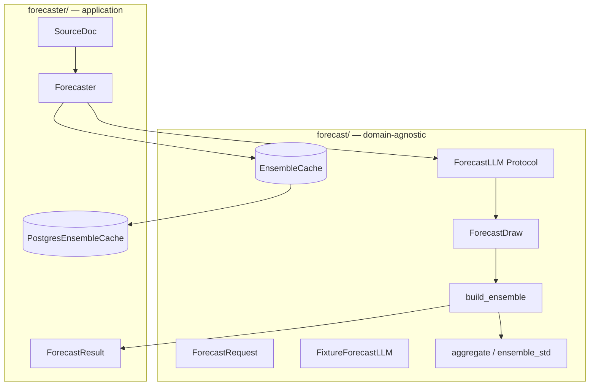
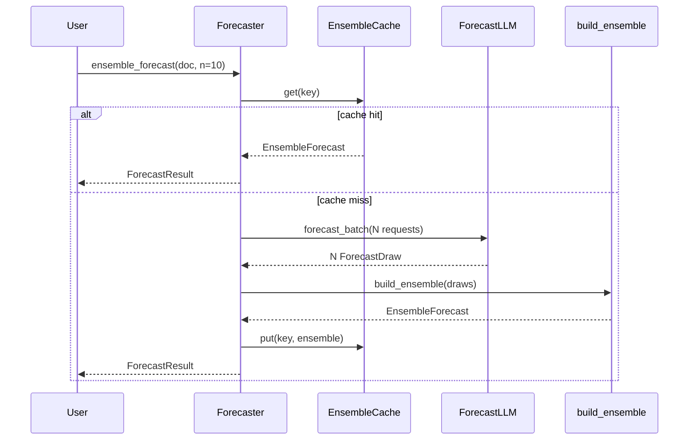
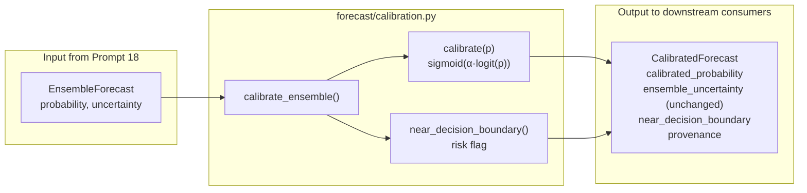
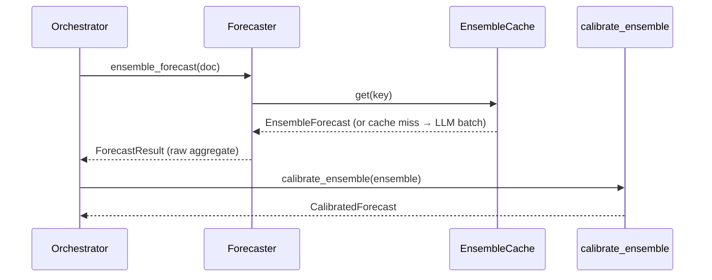

# Forecast Pipeline — Full Documentation

This document describes the domain-agnostic forecast core built in **Prompt 18** (ensemble hardening), **Prompt 19** (calibration), **Prompt 21** (supervisor reconciliation), **Prompt 22** (system-wide leakage judge), **Prompt 23** (uncertainty decomposition), and **Prompt 24** (Bayesian forecast formation). For Bayesian formation details see [BAYESIAN_DOCUMENTATION.md](BAYESIAN_DOCUMENTATION.md). For leakage-judge details see [LEAKAGE_JUDGE_DOCUMENTATION.md](LEAKAGE_JUDGE_DOCUMENTATION.md). For uncertainty details see [UNCERTAINTY_DOCUMENTATION.md](UNCERTAINTY_DOCUMENTATION.md).

Prompt 18 addresses a well-documented failure mode: **a single LLM forecast draw is unstable** — its probability swings with missing evidence, base-rate anchoring, and sampling noise. The fix is to run many independent forecasts and aggregate them robustly. The run-to-run spread is not noise to discard; it is uncertainty information carried forward to calibration (19) and uncertainty quantification (23).

Prompt 19 corrects a systematic LLM bias: forecasts **hedge toward 0.5**. A fixed-coefficient log-odds extremization transform pushes the ensemble aggregate toward 0/1 — applied once at the probability level, with a wrong-side diagnostic.

Pipeline position in the full forecast stack:

```
PIT base rate (12) + as-of search (20) → BAYESIAN formation (24) → ENSEMBLE (18) → SUPERVISOR (21) → calibrate (19) → quantify uncertainty (23) → downstream consumers
```

Prompt 24 adds explicit Bayesian updating (PIT prior × evidence log-LR → posterior) before ensemble aggregation. The legacy absolute-probability ensemble path (18 alone) remains in the application forecaster until its wiring is migrated — see [BAYESIAN_DOCUMENTATION.md §13](BAYESIAN_DOCUMENTATION.md#13-what-still-needs-to-be-done).

This document covers **ensembling (18)**, **calibration (19)**, and **supervisor reconciliation (21)**. **Bayesian formation (24)** — see [BAYESIAN_DOCUMENTATION.md](BAYESIAN_DOCUMENTATION.md). **Agentic search (20)** is implemented. **Leakage judge (22)** is implemented — see [LEAKAGE_JUDGE_DOCUMENTATION.md](LEAKAGE_JUDGE_DOCUMENTATION.md).

---

## Table of contents

1. [Mission and invariants](#1-mission-and-invariants)
2. [Architecture overview](#2-architecture-overview)
3. [Module map](#3-module-map)
4. [Domain-agnostic core (`forecast/`)](#4-domain-agnostic-core-forecast)
5. [Application layer (`forecaster/`)](#5-application-layer-forecaster)
6. [Ensemble cache](#6-ensemble-cache)
7. [Point-in-time contract](#7-point-in-time-contract)
8. [Provenance model](#8-provenance-model)
9. [End-to-end walkthrough](#9-end-to-end-walkthrough)
10. [Testing: acceptance suite EN1–EN8](#10-testing-acceptance-suite-en1en8)
11. [What still needs to be done](#11-what-still-needs-to-be-done)
12. [Known limitations and improvements](#12-known-limitations-and-improvements)
13. [Calibration (Prompt 19)](#13-calibration-prompt-19)
    - [13.1 Mission and invariants](#131-mission-and-invariants)
    - [13.2 Architecture and data flow](#132-architecture-and-data-flow)
    - [13.3 Module reference (`forecast/calibration.py`)](#133-module-reference-forecastcalibrationpy)
    - [13.4 Mathematical reference](#134-mathematical-reference)
    - [13.5 Pipeline position and downstream hand-off](#135-pipeline-position-and-downstream-hand-off)
    - [13.6 Point-in-time contract](#136-point-in-time-contract)
    - [13.7 Provenance model](#137-provenance-model)
    - [13.8 End-to-end walkthrough](#138-end-to-end-walkthrough)
    - [13.9 Testing: acceptance suite CA1–CA7](#139-testing-acceptance-suite-ca1ca7)
    - [13.10 What still needs to be done](#1310-what-still-needs-to-be-done)
    - [13.11 Known limitations and improvements](#1311-known-limitations-and-improvements)
15. [Uncertainty decomposition (Prompt 23)](#15-uncertainty-decomposition-prompt-23) — see [UNCERTAINTY_DOCUMENTATION.md](UNCERTAINTY_DOCUMENTATION.md)

---

## 1. Mission and invariants

### What this layer is for

DELPHI forms **calibrated probabilities on binary events** (election outcomes, product launches, policy decisions, etc.). A single LLM call produces a high-variance draw. Prompt 18 wraps the per-document forecast in an **ensemble**:

1. Run **N independent forecast passes** per source document (default N=10)
2. **Aggregate robustly** with median or trimmed mean — never an LLM combiner
3. Compute **run-to-run std** as a first-class uncertainty field
4. **Cache the entire ensemble** (all N raw draws + aggregate + spread) content-addressed
5. Issue all N runs via a **single batched LLM call** (Batch API in production)

The LLM is not the forecaster. The **ensemble cache** is the data of record so retrospective evaluations reproduce forever.

### Non-negotiable invariants

| Invariant | Meaning |
|-----------|---------|
| **No LLM combiner** | Aggregation is median or trimmed mean only. Asking an LLM to "combine" runs over-weights outliers and underperforms the median empirically. |
| **Spread is information** | Sample std (ddof=1) of the N raw probabilities is a first-class output, not discarded noise. Downstream consumers use it as a haircut signal. |
| **Ensemble cache is data of record** | Cache the whole ensemble keyed by `(content_hash, model_version, prompt_version, ensemble_config)`. Identical requests re-run nothing. |
| **PIT preserved** | Each run extracts as-of `doc.published_at`. Aggregation is a pure statistic over probabilities and introduces no leakage. |
| **Batched, not sequential** | All N runs are issued in one `forecast_batch()` call. Production uses the Batch API. |
| **Structured draws** | Each run emits `ForecastDraw{ probability, provenance, ... }`, not a bare float, so prompts 20/24 can add fields without changing the ensemble contract. |
| **Core vs specialized** | Domain-agnostic math lives in `forecast/`. Application `SourceDoc` wiring lives in `forecaster/`. Core never imports specialized code. |

### What is explicitly out of scope (later prompts)

| Deferred item | Prompt |
|---------------|--------|
| ~~Agentic adaptive evidence gathering per run~~ | 20 — **implemented** |
| ~~LLM disagreement-resolving supervisor~~ | 21 — **implemented**; see [§14 Supervisor (Prompt 21)](#14-supervisor-prompt-21) |
| Base-rate prior + likelihood-ratio forecasting | 24 |

---

## 2. Architecture overview

### Layer split (CLAUDE.md §11)



Specialized imports core. Core never imports the application layer.

### Data flow (cache miss)



---

## 3. Module map

```
forecast/
├── __init__.py          Public exports
├── llm.py               ForecastRequest, ForecastDraw, ForecastLLM, FixtureForecastLLM
├── ensemble.py          aggregate, ensemble_std, build_ensemble, EnsembleForecast
├── calibration.py       calibrate, calibrate_ensemble, CalibratedForecast (prompt 19)
├── search.py            Evidence, AsOfSearcher, FixtureAsOfSearch (prompt 21 seam)
├── supervisor.py        Supervisor, ReconciledForecast, confidence gate (prompt 21)
├── cache.py             EnsembleCacheKey, EnsembleCache, InMemoryEnsembleCache
├── DOCUMENTATION.md     Ensemble + calibration docs (prompts 18 + 19)
└── SUPERVISOR_DOCUMENTATION.md   Full supervisor docs (prompt 21)

forecaster/
├── chain.py             Forecaster, ForecastResult (application layer)

tests/
└── forecast/
    ├── test_ensemble_core.py
    ├── test_calibration.py
    ├── test_fixture_llm.py
    ├── test_cache.py
    ├── test_search.py
    └── test_supervisor.py   SU1–SU8 acceptance suite
```

---

## 4. Domain-agnostic core (`forecast/`)

### 4.1 `ForecastRequest`

One independent forecast draw within a batched call.

| Field | Type | Description |
|-------|------|-------------|
| `content` | `str` | Source document text to forecast over |
| `content_hash` | `str` | SHA-256 of content (for cache addressing and fixture lookup) |
| `run_index` | `int` | Zero-based index of this independent pass (0 … N-1) |
| `prompt` | `str` | Forecast prompt template |

Frozen dataclass. The forecaster builds N identical requests differing only in `run_index`.

### 4.2 `ForecastDraw`

Structured output from a single forecast pass. **Not a bare float** — designed for forward compatibility with prompts 20 (agentic search evidence trace) and 24 (likelihood-ratio path).

| Field | Type | Constraints | Description |
|-------|------|-------------|-------------|
| `probability` | `float` | `[0.0, 1.0]` | Raw pre-calibration probability for this run |
| `run_index` | `int` | `≥ 0` | Which pass produced this draw |
| `model_version` | `str` | | LLM model identifier (cache key component) |
| `prompt_version` | `str` | | Prompt template version (cache key component) |
| `provenance` | `Mapping[str, Any]` | | Per-run audit metadata (extensible) |

Pydantic frozen model. Invalid probabilities (e.g. 1.5) are rejected at validation time.

Future fields (not yet implemented) that can be added to `ForecastDraw` or its provenance without changing aggregation:

- `evidence_trace` — documents retrieved during agentic search (prompt 20)
- `evidence_log_lr` — log-likelihood ratio relative to base-rate prior (prompt 24)

The ensemble always aggregates `.probability` only.

### 4.3 `ForecastLLM` Protocol

The mockable, batched LLM seam. **The only call path** for N-run ensembles.

```python
class ForecastLLM(Protocol):
    @property
    def model_version(self) -> str: ...

    @property
    def prompt_version(self) -> str: ...

    def forecast_batch(
        self, requests: Sequence[ForecastRequest]
    ) -> Sequence[ForecastDraw]: ...
```

Production implementations should submit all requests to the **Anthropic Batch API** (Haiku-class tier per CLAUDE.md §4) in a single batch job. Tests use `FixtureForecastLLM`.

**Design note:** There is no `forecast_single()` method. This enforces batching (requirement N2 / test EN8) and prevents accidental sequential N-call patterns.

### 4.4 `FixtureForecastLLM`

Deterministic test double with no network access. Reusable across test suites for prompts 19, 20, 21, and 24.

**Constructor parameters:**

| Parameter | Default | Purpose |
|-----------|---------|---------|
| `responses` | `{}` | Map `content_hash → Sequence[float]` of explicit per-run probabilities |
| `model_version` | `"fixture-forecast-v1"` | Cache key component |
| `prompt_version` | `"delphi_forecast_v1"` | Cache key component |
| `default_response` | `(0.5,)` | Fallback probability(ies) when content_hash not in `responses` |
| `base_probability` | `None` | If set, generates noisy draws around this value (variance fixtures) |
| `noise_std` | `0.05` | Gaussian noise scale for base+noise mode |
| `seed` | `42` | RNG seed for reproducible noise |

**Counters (for test assertions):**

| Counter | Meaning |
|---------|---------|
| `batch_call_count` | Number of `forecast_batch()` invocations |
| `request_count` | Total requests across all batches |

**Probability resolution order:**

1. Explicit `responses[content_hash][run_index]` (clipped to [0, 1])
2. If `base_probability` set: `Normal(base, noise_std)` with deterministic seed per run
3. `default_response[run_index]` (cycles if shorter than N)

### 4.5 Aggregation functions (`ensemble.py`)

#### `Aggregator`

```python
Aggregator = Literal["median", "trimmed_mean"]
DEFAULT_TRIM_FRACTION = 0.1
```

#### `build_ensemble_config(n, aggregator, trim_fraction=0.1) -> str`

Serializes ensemble parameters into the cache key:

```
n=10|agg=median|trim=0.1|spread=std
```

Any change to N, aggregator, trim fraction, or spread metric produces a **new cache entry**.

#### `aggregate(probabilities, aggregator, *, trim_fraction=0.1) -> float`

Robust aggregation over N raw probabilities.

| Aggregator | Behavior |
|------------|----------|
| `"median"` | `numpy.median` — default; empirically best variance reduction |
| `"trimmed_mean"` | Sort, symmetrically trim `trim_fraction` from each tail, mean the remainder. Falls back to plain mean if N < 3. |

Raises `ValueError` on empty input or unsupported aggregator.

#### `ensemble_std(probabilities) -> float`

Sample standard deviation with **ddof=1** on raw pre-calibration probabilities.

| N | Result |
|---|--------|
| 0 or 1 | `0.0` |
| ≥ 2 | `numpy.std(probabilities, ddof=1)` |

**Why std, not IQR:** The robust aggregator already absorbs outliers in the point estimate. Std's job is to *expose* run-to-run disagreement for stability haircuts (prompt 23). IQR would suppress disagreement. Std also composes cleanly with the Bernoulli event-uncertainty term in uncertainty decomposition.

#### `EnsembleForecast`

Frozen dataclass — the core aggregated result.

| Field | Type | Description |
|-------|------|-------------|
| `probability` | `float` | Robust aggregate of N draws |
| `uncertainty` | `float` | Sample std of N draws |
| `n` | `int` | Number of runs |
| `aggregator` | `Aggregator` | Method used |
| `trim_fraction` | `float` | Trim fraction (for trimmed_mean) |
| `knowledge_time` | `datetime` | PIT as-of timestamp |
| `draws` | `tuple[ForecastDraw, ...]` | All N raw draws |
| `provenance` | `Mapping[str, Any]` | Aggregation audit record |

#### `build_ensemble(draws, *, aggregator, knowledge_time, trim_fraction=0.1) -> EnsembleForecast`

Orchestrates aggregation + spread + provenance assembly. Raises `ValueError` on empty draws.

**Provenance payload structure:**

```python
{
    "aggregation_method": "median",
    "trim_fraction": 0.1,
    "spread_metric": "std",
    "n_runs": 10,
    "run_provenance": [{...}, ...],   # one dict per draw
    "raw_probabilities": [0.48, 0.52, ...],
}
```

### 4.6 Ensemble cache (`cache.py`)

#### `EnsembleCacheKey`

| Field | Description |
|-------|-------------|
| `content_hash` | SHA-256 of source document content |
| `model_version` | LLM model identifier |
| `prompt_version` | Prompt template version |
| `ensemble_config` | Serialized `n|agg|trim|spread` string |

#### `EnsembleCache` ABC

| Method | Contract |
|--------|----------|
| `get(key) -> EnsembleForecast \| None` | Return cached ensemble or None on miss |
| `put(key, forecast) -> None` | Append-only; identical keys are idempotent (no overwrite) |

#### `InMemoryEnsembleCache`

Dict-backed implementation for tests and local development. Exposes `.keys` property for test inspection.

---

## 5. Application layer (`forecaster/`)

### 5.1 `ForecastResult`

Pydantic frozen model — the public return type of `ensemble_forecast()`.

| Field | Type | Description |
|-------|------|-------------|
| `probability` | `float` [0, 1] | Robust aggregate |
| `uncertainty` | `float` ≥ 0 | Sample std of N runs |
| `n` | `int` ≥ 1 | Ensemble size |
| `aggregator` | `Aggregator` | `"median"` or `"trimmed_mean"` |
| `knowledge_time` | `datetime` | PIT as-of (= `doc.published_at`) |
| `content_hash` | `str` | Source document hash |
| `model_version` | `str` | LLM model used |
| `prompt_version` | `str` | Prompt version used |
| `draws` | `tuple[ForecastDraw, ...]` | All N raw draws |
| `provenance` | `dict[str, Any]` | Full audit trail |

### 5.2 Application `ForecastLLM` alias

Production application forecasters implement the `ForecastLLM` Protocol with an application-specific prompt. A type alias documents intent at the specialized layer without duplicating the interface.

### 5.3 Default forecast prompt

```python
FORECAST_PROMPT_VERSION = "delphi_forecast_v1"

_DEFAULT_FORECAST_PROMPT = (
    "Estimate the probability (0-1) that the primary binary event "
    "described in this source document occurs. Return only a JSON "
    'object with key "probability".'
)
```

This is a **plain probability** prompt. It does not elicit likelihood ratios or inject base-rate priors — that lands in prompt 24 and will change only the concrete LLM implementation's internals, leaving this seam stable.

### 5.4 `Forecaster`

Main entry point for application ensemble forecasting.

**Constructor:**

| Parameter | Default | Description |
|-----------|---------|-------------|
| `llm` | (required) | `ForecastLLM` implementation |
| `cache` | (required) | `EnsembleCache` implementation |
| `prompt` | `_DEFAULT_FORECAST_PROMPT` | Forecast prompt template |
| `trim_fraction` | `0.1` | Trim fraction for trimmed_mean aggregator |

**Method: `ensemble_forecast(doc, *, n=10, aggregator="median") -> ForecastResult`**

Algorithm:

1. Validate `n >= 1`
2. Build `ensemble_config` string and `EnsembleCacheKey`
3. **Cache lookup** — on hit, map cached `EnsembleForecast` → `ForecastResult` and return (no LLM calls)
4. Build N `ForecastRequest`s (same content, `run_index` 0…N-1)
5. Call `llm.forecast_batch(requests)` — **one batched call**
6. Validate `len(draws) == n`
7. `build_ensemble(draws, knowledge_time=doc.published_at, ...)`
8. `cache.put(key, ensemble)`
9. Return `ForecastResult`

### 5.5 `PostgresEnsembleCache`

PostgreSQL-backed `EnsembleCache`. Mirrors the pattern of `PostgresExtractionCache` from prompt 12.

| Method | Description |
|--------|-------------|
| `connect(dsn, migrate=True)` | Connect and optionally run migrations |
| `apply_migrations()` | Run all migration `*.sql` files |
| `get(key)` | SELECT from `ensemble_cache` |
| `put(key, forecast)` | INSERT … ON CONFLICT DO NOTHING |

Serializes/deserializes `EnsembleForecast` as JSONB including all draws.

Context manager support (`with PostgresEnsembleCache.connect(dsn) as cache:`).

---

## 6. Ensemble cache

### Postgres schema (`0002_ensemble_cache.sql`)

```sql
CREATE TABLE ensemble_cache (
    id              BIGINT GENERATED ALWAYS AS IDENTITY PRIMARY KEY,
    content_hash    TEXT        NOT NULL,
    model_version   TEXT        NOT NULL,
    prompt_version  TEXT        NOT NULL,
    ensemble_config TEXT        NOT NULL,
    ensemble        JSONB       NOT NULL DEFAULT '{}',
    inserted_at     TIMESTAMPTZ NOT NULL DEFAULT now(),
    UNIQUE (content_hash, model_version, prompt_version, ensemble_config)
);
```

**Append-only enforcement:** `BEFORE UPDATE` and `BEFORE DELETE` triggers raise exceptions, matching the extraction cache pattern.

**Lookup index:** `(content_hash, model_version, prompt_version, ensemble_config)`.

### Cache key worked example

For a document with `content_hash="abc123…"`, model `"claude-haiku-20251001"`, prompt `"delphi_forecast_v1"`, and default ensemble settings:

```
Key = (
    content_hash = "abc123…",
    model_version = "claude-haiku-20251001",
    prompt_version = "delphi_forecast_v1",
    ensemble_config = "n=10|agg=median|trim=0.1|spread=std",
)
```

Changing `n=15` or `aggregator=trimmed_mean` produces a **different key** and triggers a new ensemble run.

### Cached payload

The full `EnsembleForecast` JSON including:

- Aggregate probability and uncertainty
- All N `ForecastDraw` objects with per-run provenance
- Aggregation provenance (method, raw probabilities, spread metric)

The cache stores the **complete ensemble**, not just the aggregate. Reproducibility requires the raw draws.

---

## 7. Point-in-time contract

### Per-run as-of

Each of the N forecast passes receives the same `SourceDoc` with `published_at` as the knowledge ceiling. The LLM sees only the document text available at publication time (structural PIT guarantee from the ingestion layer).

### Aggregate knowledge_time

```python
knowledge_time = ensure_utc(doc.published_at)
```

The aggregated `ForecastResult.knowledge_time` equals the source document's publication time. Aggregation is a deterministic function of the N probabilities and introduces **no future information**.

### Relationship to extraction

| Layer | Input | Output | knowledge_time |
|-------|-------|--------|----------------|
| Extraction (12) | `SourceDoc` | extraction record (structured facts) | `doc.published_at` (+ model offset for re-extractions) |
| Ensemble (18) | `SourceDoc` | `ForecastResult` (probability + uncertainty) | `doc.published_at` |

These are **parallel pipelines** over the same source documents. Extraction produces structured facts; forecasting produces event probabilities. They share the extraction cache pattern but use separate cache tables.

---

## 8. Provenance model

Every `ForecastResult` carries two levels of provenance:

### Per-run provenance (`ForecastDraw.provenance`)

Each draw records its own audit metadata. In tests:

```python
{"fixture": True, "content_hash": "…", "run_index": 3}
```

Production implementations should record batch job ID, token counts, latency, and (later) evidence retrieval traces.

### Ensemble provenance (`ForecastResult.provenance`)

Assembled by `build_ensemble()`:

```python
{
    "aggregation_method": "median",
    "trim_fraction": 0.1,
    "spread_metric": "std",
    "n_runs": 10,
    "run_provenance": [ {...}, {...}, ... ],
    "raw_probabilities": [0.45, 0.52, 0.48, ...],
}
```

This satisfies test EN6: the record carries provenance for all N runs plus the aggregation method.

---

## 9. End-to-end walkthrough

### Test / local workflow

```python
from forecaster import Forecaster
from forecast import FixtureForecastLLM, InMemoryEnsembleCache

# 1. Source document (from ingestion adapters or constructed directly)
doc = SourceDoc(
    source="news",
    source_id="ELECTION-2024-001",
    content="The runoff election is scheduled for February 10, 2024. Polling averages show the incumbent ahead.",
    published_at=utc_dt(2024, 1, 8),
)

# 2. Deterministic fixture LLM (tests) or production ForecastLLM (Bedrock Batch)
llm = FixtureForecastLLM(
    responses={
        doc.content_hash: (0.42, 0.45, 0.48, 0.50, 0.52, 0.55, 0.48, 0.51, 0.49, 0.53),
    },
)

# 3. Forecaster with in-memory cache
forecaster = Forecaster(llm, InMemoryEnsembleCache())

# 4. First call — cache miss, one batch of 10 runs
forecast = forecaster.ensemble_forecast(doc, n=10, aggregator="median")
print(forecast.probability)   # ~0.493 (median of draws)
print(forecast.uncertainty)   # ~0.038 (std of draws)
print(forecast.knowledge_time)  # 2024-01-08T00:00:00+00:00

# 5. Second call — cache hit, no LLM re-runs
forecast2 = forecaster.ensemble_forecast(doc, n=10, aggregator="median")
assert forecast2.probability == forecast.probability
assert llm.batch_call_count == 1  # still 1
```

### Production workflow (not yet implemented — see §11)

```python
# Pseudocode — production ForecastLLM not yet wired
cache = PostgresEnsembleCache.connect(os.environ["DELPHI_PG_DSN"])
llm = BedrockBatchForecastLLM(model="claude-haiku-…")  # TODO
forecaster = Forecaster(llm, cache)

for doc in pending_source_docs:
    forecast = forecaster.ensemble_forecast(doc)
    # forecast.probability → calibration (19) → uncertainty (23)
```

---

## 10. Testing: acceptance suite EN1–EN8

All tests use `FixtureForecastLLM` — no live LLM or network calls.

| Test | File | What it proves |
|------|------|----------------|
| **EN1** Variance reduction | `test_ensemble.py` | Aggregate of N noisy draws is closer to planted truth than a single draw |
| **EN2** Robust aggregation | `test_ensemble.py` | Injected outlier (0.99 among 0.5s) does not move median; no LLM combiner |
| **EN3** Uncertainty | `test_ensemble.py` | High-disagreement fixture yields wide std; consensus yields narrow; std is first-class field |
| **EN4** Reproducibility | `test_ensemble.py` | Identical inputs return cached ensemble (batch_call_count unchanged); config change = new entry |
| **EN5** PIT preserved | `test_ensemble.py` | `knowledge_time == doc.published_at`; per-run provenance records content_hash |
| **EN6** Provenance | `test_ensemble.py` | Record carries all N run provenances + aggregation method |
| **EN7** Determinism | `test_ensemble.py` | Same fixture LLM + doc → identical probability and uncertainty |
| **EN8** Batching | `test_ensemble.py` | N=10 runs issued in exactly 1 batch call |

Additional §8 unit tests cover:

- Core aggregation edge cases (`test_ensemble_core.py`)
- Fixture LLM modes (`test_fixture_llm.py`)
- Cache get/put/idempotency (`test_cache.py`)
- Invalid probability rejection (Pydantic validation)
- `n=0` raises, `n=1` gives zero uncertainty
- Trimmed mean aggregator option

**Run tests:**

```bash
uv run pytest tests/forecast/ -v
```

**Full gates:**

```bash
uv run pytest && uv run pyright && uv run ruff check .
```

---

## 11. What still needs to be done

### Production LLM client (P0)

| Item | Status | Work required |
|------|--------|---------------|
| **`BedrockBatchForecastLLM`** | Not implemented | Concrete `ForecastLLM` that submits N requests to Anthropic Batch API (Haiku tier), polls for results, parses JSON `{"probability": float}`, returns N `ForecastDraw`s |
| **Response parsing + validation** | Not implemented | JSON schema validation, malformed response rejection (mirror extraction's reject/flag pattern) |
| **Retry / partial batch failure** | Not implemented | Handle Batch API job failures, timeouts, and partial result sets |
| **Cost tracking** | Not implemented | Log token usage per batch job for experiment accounting |

The `_DEFAULT_FORECAST_PROMPT` is a minimal one-liner. Production needs a full prompt template file with schema enforcement examples, parallel to the extraction prompt.

### Infrastructure setup (P0)

| Item | Status | Work required |
|------|--------|---------------|
| **Run migration `0002_ensemble_cache.sql`** | SQL exists, not applied | `PostgresEnsembleCache.connect(dsn, migrate=True)` runs all migrations including the new ensemble table. Requires a reachable Postgres instance (`DELPHI_PG_DSN`). |
| **Postgres integration tests** | Not written | Mirror extraction cache Postgres tests with `@pytest.mark.postgres` |
| **Separate migration runner** | Not implemented | Currently migrations run via cache connect; consider a dedicated `delphi migrate` command |

### Pipeline integration (P1)

| Item | Status | Work required |
|------|--------|---------------|
| **Wire forecaster into orchestration loop** | Not implemented | Prompt 16 orchestrator should call the as-of searcher, render gathered evidence into a forecast document, and invoke `Forecaster` after ingestion |
| **Registry logging** | Not implemented | Log ensemble forecasts to experiment registry with code hash, params, cache key |
| **CLI entry point** | Not implemented | e.g. `delphi forecast ensemble --doc-id …` |
| **Link extraction → forecast** | Not wired | Currently independent pipelines over `SourceDoc`. Orchestration should ingest → extract → forecast in sequence |
| **PIT fact write for forecasts** | Not implemented | Optionally append `ForecastResult` results as PIT facts (new dataset e.g. `forecasts`) for downstream feature consumption |
| **Wire calibration into orchestration** | Not implemented | After `Forecaster.ensemble_forecast()`, call `calibrate_ensemble()`. No application wrapper yet — callers use the domain-agnostic core directly |
| **Registry logging for calibrated forecasts** | Not implemented | Log `CalibratedForecast` to experiment registry with code hash, alpha, diagnostic flags |
| **Application-layer convenience wrapper** | Not implemented | Optional `Forecaster.calibrated_forecast(doc)` that chains ensemble + calibration in one call |

### Calibration-specific setup (P1)

| Item | Status | Work required |
|------|--------|---------------|
| **End-to-end pipeline test** | Not written | Integration test: `SourceDoc` → ensemble → calibrate → assert `CalibratedForecast` fields |
| **Orchestrator hook** | Not wired | Prompt 16 orchestrator should call `calibrate_ensemble()` after ensemble |
| **Monitoring for diagnostic rate** | Not implemented | Track fraction of forecasts flagged `near_decision_boundary`; alert on spikes |
| **PIT fact write for calibrated forecasts** | Not implemented | Optionally persist `CalibratedForecast` as PIT facts for historical as-of queries |

### Downstream consumers (later prompts — do not build now)

| Item | Prompt | Dependency on this work |
|------|--------|------------------------|
| Calibration / extremization | 19 | **Implemented** — `calibrate_ensemble()` consumes `EnsembleForecast.probability` + `uncertainty` |
| Agentic evidence search | 20 | Extends `ForecastDraw` provenance; runs still batched through `ForecastLLM` |
| Stability haircut | 23 | **Implemented** — `quantify_uncertainty()` decomposes event vs LLM-output; `apply_stability_haircut()` for downstream consumers; surfaced in monitoring (15) |
| Base-rate prior + log-LR | 24 | Changes concrete LLM impl internals; `ForecastLLM` Protocol stays stable |
| Leakage judge audit | Future | Audits forecast traces as defense-in-depth |

---

## 12. Known limitations and improvements

### Current limitations

1. **Fixture-only LLM** — No production `ForecastLLM` implementation. `FixtureForecastLLM` is the only concrete class. Production Bedrock Batch client is an extension seam only.

2. **No Postgres ensemble cache tests** — `PostgresEnsembleCache` mirrors the extraction cache pattern but has no `@pytest.mark.postgres` test coverage yet.

3. **Plain probability prompt only** — No base-rate prior injection, no likelihood-ratio elicitation, no agentic evidence gathering. The forecast is a raw LLM probability, not the full §10 pipeline from CLAUDE.md (that arrives in prompts 20 and 24).

4. **Forecast and extraction are decoupled** — `Forecaster` reads `SourceDoc` directly, not the extraction record. A document may contain multiple events but the forecaster produces one probability for "the primary binary event." Multi-event disambiguation is not implemented.

5. **No PIT fact write for forecasts** — Ensemble results live in the ensemble cache only, not in the PIT store. Downstream features cannot yet query historical forecasts via `store.as_of()`.

6. **Default prompt is minimal** — One sentence. Production needs structured prompt engineering with few-shot examples and output schema enforcement.

7. **Cross-document evidence via agentic search (prompt 20)** — The agentic searcher gathers PIT-correct evidence across the corpus and renders it into a synthetic `SourceDoc` for `Forecaster`. Not yet wired into the default forecaster path.

8. **Trim fraction not exposed on `ensemble_forecast()`** — Configurable via the `Forecaster(trim_fraction=…)` constructor but not per-call. Cache key includes trim fraction from constructor, not call-site override.

9. **No monitoring / drift detection** — No metrics on ensemble spread distributions, cache hit rates, or model version comparisons.

10. **Migration runs all ingest migrations** — `PostgresEnsembleCache.apply_migrations()` runs every migration file, not just ensemble-specific ones. Harmless (idempotent DDL) but couples cache init to extraction schema.

11. **Calibration not wired into application forecaster** — `Forecaster` returns a raw pre-calibration `ForecastResult`. Callers must explicitly call `calibrate_ensemble()` on the underlying `EnsembleForecast`. No one-call `calibrated_forecast()` wrapper yet.

12. **Diagnostic thresholds are static defaults** — `boundary_margin=0.05` and `spread_threshold=0.15` are not yet exposed via typed settings or per-domain config. Changing them requires passing kwargs at call time.

13. **No calibration cache** — Calibration is a pure deterministic transform applied at read time. Unlike the ensemble cache, calibrated results are not persisted separately. Reproducibility comes from the ensemble cache + fixed alpha; no separate cache table exists.

14. **No empirical calibration monitoring** — No dashboard or metrics tracking pre/post-calibration distribution shifts, diagnostic flag rates, or whether extremization improves live forecast accuracy.

### Calibration-specific limitations

1. **Aggregate only** — Individual ensemble runs are not calibrated; only the robust aggregate is extremized. This is intentional (calibrate once) but means per-run probabilities in provenance remain hedged.

2. **Supervisor not wired into application forecaster** — `Forecaster` returns a pre-supervisor `ForecastResult`. Callers must explicitly invoke `Supervisor.reconcile()` on the underlying `EnsembleForecast` before calibration.

3. **Diagnostic is advisory only** — `near_decision_boundary` flags risky cases but does not block downstream use or trigger re-search. Downstream consumers must decide how to act on the flag.

4. **Alpha not in ensemble cache key** — Changing `alpha` does not invalidate the ensemble cache (correct — ensemble is pre-calibration). Callers must ensure they always use the same alpha for reproducibility; it is not content-addressed.

### Recommended improvements

| Priority | Improvement | Rationale |
|----------|-------------|-----------|
| **P0** | Production `BedrockBatchForecastLLM` | Unblocks real ensemble forecasts at scale |
| **P0** | Postgres integration tests for ensemble cache | Parity with extraction cache test coverage |
| **P1** | PIT fact write for `ForecastResult` | Enables `as_of` queries and feature library consumption |
| **P1** | Per-event forecasting (not per-document) | A single document may mention multiple events; forecast should target a specific extraction record |
| **P1** | Full prompt template file | Schema-enforced JSON output, few-shot examples, domain-specific guidance |
| **P1** | Orchestration wiring + registry logging | Forecasts must flow through the standard experiment runner with trials accounting |
| **P2** | Cache hit/miss metrics + spread distribution dashboard | Monitor model stability and ensemble disagreement over time |
| **P2** | Configurable N via settings (not just call-site) | Operator control over cost vs variance tradeoff |
| **P2** | Parallel batch chunking for very large backfills | Split 10K documents into Batch API jobs with concurrency limits |
| **P3** | Ensemble comparison across model versions | A/B model evaluation using separate cache keys |
| **P3** | Secondary IQR diagnostic (not first-class) | Logged for analysis but never used downstream |
| **P1** | `Forecaster.calibrated_forecast()` wrapper | One-call ensemble + calibration for the application layer |
| **P1** | End-to-end orchestration test (ensemble → calibrate) | Proves pipeline wiring before production |
| **P2** | Typed settings for diagnostic thresholds | Operator control without code changes |
| **P2** | Calibration monitoring dashboard | Track diagnostic rate, pre/post distribution, flag-rate by domain |
| **P3** | Optional PIT fact write for `CalibratedForecast` | Historical as-of queries for calibrated probabilities |

### Design decisions worth preserving

- **Median default, no LLM combiner** — Empirically validated; clever aggregation underperforms simple robust statistics.
- **Std as first-class uncertainty** — Exposes disagreement for downstream consumers; distinct from the robust point estimate.
- **Structured `ForecastDraw`** — Extensible for evidence traces and log-LRs without breaking aggregation.
- **Batched-only LLM seam** — Prevents N sequential calls; enforces Batch API usage in production.
- **Ensemble cache as data of record** — Caches all N raw draws, not just the aggregate; full reproducibility.
- **Core/specialized split** — `forecast/` is reusable for a general forecaster variant (CLAUDE.md §11).
- **Content-addressed cache keys including ensemble config** — Config changes produce new entries; never silently overwrite.
- **Fixed α calibration, never learned** — Anti-overfitting discipline for probability extremization.
- **Calibrate once at aggregate level** — Uncertainty passed through unchanged; downstream consumers handle it separately.

---

## 13. Calibration (Prompt 19)

Prompt 19 implements **fixed-coefficient probability calibration** — a deterministic transform that extremizes LLM ensemble aggregates toward 0/1 to correct systematic hedging toward 0.5. It operates on the domain-agnostic core in `forecast/calibration.py` and hands off a `CalibratedForecast` to downstream consumers.

Pipeline position:

```
agentic search (20) → ENSEMBLE (18) → CALIBRATE (19) → downstream consumers
                              ↑              ↑
                         EnsembleForecast   CalibratedForecast
                         (raw aggregate)    (calibrated p + spread)
```

This prompt implements **calibration only**. Agentic search and supervisor reconciliation are separate prompts.

---

### 13.1 Mission and invariants

#### What this layer is for

After prompt 18 produces a robust ensemble aggregate, prompt 19 applies a **single log-odds extremization** to correct LLM hedging:

1. Take the ensemble **aggregate probability** (median/trimmed mean of N runs)
2. Apply `sigmoid(α · logit(p))` with **fixed α = √3**
3. Flag near-0.5 / high-spread forecasts where extremization is risky
4. Hand off **calibrated probability + unchanged ensemble uncertainty** to downstream consumers

The transform is pure, deterministic, and PIT-neutral. No LLM, no network, no learned parameters.

#### Non-negotiable invariants

| Invariant | Meaning |
|-----------|---------|
| **Fixed coefficient** | `α` defaults to `sqrt(3)` and is never fit on outcome data. Fitting α would overfit calibration exactly as unconstrained variant search overfits the evaluation gate. |
| **Calibrate the aggregate, not individual runs** | Only `EnsembleForecast.probability` is extremized. Raw per-run probabilities in provenance remain unchanged. |
| **Calibrate once; consume separately** | Calibration happens at the probability level only. `ensemble_uncertainty` (std from prompt 18) is passed through **unchanged**. Downstream consumers must not re-extremize confidence. |
| **Amplifies, including errors** | Extremization helps only when the forecast is on the correct side of 0.5. Wrong-side forecasts are pushed further wrong. Calibration is downstream of evidence, not a substitute for it. |
| **PIT-neutral** | The transform is a pure function of the aggregate probability. It reads no future data and introduces no leakage. |
| **Deterministic + reproducible** | Same `(ensemble, alpha, thresholds)` → same `CalibratedForecast`. Method and coefficient are recorded in provenance. |
| **Core vs specialized** | All calibration logic lives in `forecast/calibration.py`. No domain assumptions. The application layer calls the core directly. |

#### What is explicitly out of scope

| Deferred item | Prompt |
|---------------|--------|
| Agentic adaptive evidence gathering | 20 |
| Supervisor disagreement reconciliation | Future enhancement |
| Fitting α on outcome data | **Forbidden** — never build |
| Re-extremizing uncertainty downstream | **Forbidden** — double-counts confidence |

---

### 13.2 Architecture and data flow



**Cache miss path (typical production flow):**



Note: calibration is **not cached separately**. It is recomputed deterministically from the cached ensemble. Reproducibility requires the ensemble cache entry + fixed α.

---

### 13.3 Module reference (`forecast/calibration.py`)

#### Constants

| Name | Value | Description |
|------|-------|-------------|
| `DEFAULT_ALPHA` | `math.sqrt(3)` ≈ 1.732 | Fixed extremization coefficient (Neyman-Roughgarden). Configurable via kwarg but **never fit on data**. |
| `DEFAULT_BOUNDARY_MARGIN` | `0.05` | Flag forecasts where `abs(p - 0.5) < 0.05` |
| `DEFAULT_SPREAD_THRESHOLD` | `0.15` | Flag forecasts where ensemble std exceeds 0.15 |
| `_PROB_EPS` | `1e-12` | Internal clamp bound for numerical stability at p near 0/1 |

#### `calibrate(p: float, *, alpha: float = DEFAULT_ALPHA) -> float`

Extremize a single probability toward 0/1.

**Contract:**

- Input: `p ∈ [0, 1]`, finite; `alpha > 0`, finite
- Output: calibrated probability in `[0, 1]`
- Transform: `sigmoid(alpha · logit(p))`
- Identity: `p == 0.5` → `0.5` exactly (no clamping applied)
- Monotonic: strictly increasing in `p` for `p ≠ 0.5`

**Numerical stability:**

- `p == 0.5`: early return, no logit computation
- `p ∈ {0, 1}` or near extremes: clamp to `[eps, 1-eps]` before logit
- Sigmoid uses branch-stable form (compute via `exp(-x)` when `x ≥ 0`, else `exp(x)/(1+exp(x))`)

**Raises:** `ValueError` if `p` not in `[0, 1]` or not finite; if `alpha ≤ 0` or not finite.

**Example:**

```python
from forecast import calibrate
import math

calibrate(0.6)                          # ≈ 0.668 (pushed toward 1)
calibrate(0.4)                          # ≈ 0.332 (pushed toward 0)
calibrate(0.5)                          # 0.5 exactly
calibrate(0.6, alpha=math.sqrt(3))      # same as default
```

#### `near_decision_boundary(p, uncertainty, *, boundary_margin, spread_threshold) -> bool`

Diagnostic flag for forecasts where extremization is especially risky.

**Returns `True` when either:**

1. `abs(p - 0.5) < boundary_margin` — forecast is near the decision boundary
2. `uncertainty > spread_threshold` — ensemble runs disagree substantially

**Rationale:** Near 0.5, extremization amplifies whichever side the forecast is on — including the wrong side. High spread means the model is unstable on this question; extremizing an unstable near-0.5 forecast is dangerous.

**Raises:** `ValueError` on invalid `p`, `uncertainty`, `boundary_margin`, or `spread_threshold`.

**Example:**

```python
from forecast import near_decision_boundary

near_decision_boundary(0.52, 0.01)   # True  — near 0.5
near_decision_boundary(0.70, 0.20)   # True  — high spread
near_decision_boundary(0.75, 0.05)  # False — decisive and stable
```

#### `CalibratedForecast`

Frozen dataclass — the **downstream hand-off contract**.

| Field | Type | Description |
|-------|------|-------------|
| `calibrated_probability` | `float` | Once-calibrated aggregate. **This is the probability downstream consumers use.** |
| `ensemble_uncertainty` | `float` | Raw sample std from prompt 18. **Passed through unchanged** — not re-extremized. |
| `raw_probability` | `float` | Pre-calibration ensemble aggregate (for audit/comparison) |
| `near_decision_boundary` | `bool` | Diagnostic flag from `near_decision_boundary()` |
| `provenance` | `Mapping[str, Any]` | Full audit record (method, coefficient, thresholds, nested ensemble provenance) |

**Important:** Downstream consumers must use `calibrated_probability` for the point estimate and `ensemble_uncertainty` for the spread haircut. They must **not** apply a second extremization to either field.

#### `calibrate_ensemble(ensemble, *, alpha, boundary_margin, spread_threshold) -> CalibratedForecast`

Orchestrates calibration + diagnostic + provenance assembly.

**Algorithm:**

1. Read `raw_p = ensemble.probability`
2. Compute `calibrated_p = calibrate(raw_p, alpha=alpha)`
3. Run `near_decision_boundary(raw_p, ensemble.uncertainty, ...)`
4. Assemble provenance (method, alpha, thresholds, raw/calibrated values, nested ensemble provenance)
5. Return `CalibratedForecast` with `ensemble_uncertainty = ensemble.uncertainty` (unchanged)

**Does not modify** the input `EnsembleForecast`. Does not calibrate individual draws.

#### Internal helpers (not exported)

| Function | Purpose |
|----------|---------|
| `_clamp_probability(p)` | Clamp to `[1e-12, 1 - 1e-12]` before logit |
| `_sigmoid(x)` | Branch-stable sigmoid |
| `_validate_probability(p)` | Raise on invalid probability |
| `_validate_alpha(alpha)` | Raise on invalid alpha |

---

### 13.4 Mathematical reference

#### Transform

Log-odds extremization (Platt scaling with zero intercept):

```
calibrate(p) = sigmoid(α · logit(p))
             = 1 / (1 + exp(-α · log(p / (1-p))))
```

Equivalent geometric-mean (power-mean) form:

```
calibrate(p) = p^α / (p^α + (1-p)^α)
```

Both forms are tested to match in CA4.

#### Empirical basis

LLMs systematically hedge toward 0.5 due to post-training alignment. Platt scaling / log-odds extremization with a **fixed** coefficient (√3, from Neyman-Roughgarden) closes the gap to expert calibration in held-out studies. Fitting α on your own outcomes would overfit — the fixed value is the robust, disciplined choice.

#### Worked examples (α = √3)

| Raw p | Calibrated p | Direction | Notes |
|-------|-------------|-----------|-------|
| 0.50 | 0.500 | — | Identity (exact) |
| 0.55 | 0.562 | ↑ | Mild push toward 1 |
| 0.60 | 0.668 | ↑ | Moderate extremization |
| 0.70 | 0.802 | ↑ | Strong push |
| 0.85 | 0.936 | ↑ | Near ceiling |
| 0.45 | 0.438 | ↓ | Mild push toward 0 |
| 0.40 | 0.332 | ↓ | Moderate extremization |
| 0.30 | 0.198 | ↓ | Strong push |
| 0.15 | 0.064 | ↓ | Near floor |
| 0.01 | ≈0.000 | ↓ | Stable (clamped, no NaN) |
| 0.99 | ≈1.000 | ↑ | Stable (clamped, no NaN) |

#### Wrong-side amplification example

If the true event probability is 0.85 but the ensemble aggregate is 0.40 (wrong side):

```
calibrate(0.40) ≈ 0.332   # pushed further from truth, toward 0
```

This demonstrates why calibration is downstream of good evidence — it cannot fix a wrong-side forecast, only amplify it.

---

### 13.5 Pipeline position and downstream hand-off

#### What downstream consumers receive

| Field | Source | Used for |
|-------|--------|----------|
| `calibrated_probability` | Prompt 19 | Point estimate for downstream decisions |
| `ensemble_uncertainty` | Prompt 18 (passed through) | Spread haircut — unstable forecasts down-weighted |
| `near_decision_boundary` | Prompt 19 diagnostic | Optional additional haircut or abstain signal |

#### What downstream consumers must NOT do

- Re-apply `calibrate()` or any extremization to `calibrated_probability`
- Extremize or transform `ensemble_uncertainty` (it is already a spread measure, not a probability)
- Use `raw_probability` for decisions (that is the pre-calibration hedged estimate)

#### Relationship to CLAUDE.md §10 pipeline

Full forecast formation pipeline (in order):

1. Prior = computed base rate (prompt 24)
2. Evidence = agentic as-of search (prompt 20)
3. Likelihood ratio, not probability (prompt 24)
4. Ensemble (~10 runs, robust aggregate) (prompt 18)
5. Supervisor reconciliation (future)
6. **Calibrate once** (prompt 19 — this module)
7. Decompose uncertainty → stability haircut (prompt 23 — **implemented** in `forecast/uncertainty.py`)

Prompt 19 implements step 6 only. Prompt 23 implements step 7.

---

### 13.6 Point-in-time contract

Calibration is **PIT-neutral**:

- Input is `EnsembleForecast`, which already carries the correct `knowledge_time` from prompt 18
- The transform reads only `ensemble.probability` and `ensemble.uncertainty` — both are pure statistics over PIT-correct runs
- No additional data access, no clock reads, no network calls
- `CalibratedForecast` does not carry its own `knowledge_time`; inherit from the source ensemble when logging

**Leakage test implication:** Adding future ensemble runs to the input would change the aggregate (an ensemble-layer concern), but the calibration transform itself introduces no additional look-ahead beyond what the ensemble already encodes.

---

### 13.7 Provenance model

Every `CalibratedForecast` carries a provenance dict assembled by `calibrate_ensemble()`:

```python
{
    "calibration_method": "platt_logodds_extremization",
    "alpha": 1.7320508075688772,
    "boundary_margin": 0.05,
    "spread_threshold": 0.15,
    "raw_probability": 0.493,
    "calibrated_probability": 0.512,
    "ensemble_provenance": {
        "aggregation_method": "median",
        "trim_fraction": 0.1,
        "spread_metric": "std",
        "n_runs": 10,
        "run_provenance": [{...}, ...],
        "raw_probabilities": [0.48, 0.52, ...],
    },
}
```

**Two-level audit trail:**

1. **Calibration provenance** (top level) — method, coefficient, thresholds, raw/calibrated values
2. **Ensemble provenance** (nested) — full prompt 18 audit record including all N run provenances

This satisfies CA7 and enables full reproducibility: given the ensemble cache entry and alpha, the calibrated output is deterministic and auditable.

---

### 13.8 End-to-end walkthrough

#### Test / local workflow

```python
from datetime import UTC, datetime

from forecast import (
    FixtureForecastLLM,
    ForecastDraw,
    build_ensemble,
    calibrate,
    calibrate_ensemble,
    near_decision_boundary,
)

# 1. Build an ensemble from fixture draws (normally from Forecaster)
draws = tuple(
    ForecastDraw(
        probability=p,
        run_index=i,
        model_version="fixture-v1",
        prompt_version="delphi_forecast_v1",
        provenance={"run_index": i},
    )
    for i, p in enumerate([0.52, 0.55, 0.58, 0.54, 0.56, 0.53, 0.57, 0.55, 0.54, 0.56])
)
kt = datetime(2024, 1, 15, tzinfo=UTC)
ensemble = build_ensemble(draws, aggregator="median", knowledge_time=kt)

print(f"Raw aggregate:    {ensemble.probability:.3f}")   # ~0.550
print(f"Ensemble spread:  {ensemble.uncertainty:.3f}")   # ~0.019

# 2. Calibrate once
calibrated = calibrate_ensemble(ensemble)
print(f"Calibrated:       {calibrated.calibrated_probability:.3f}")  # ~0.562
print(f"Spread (unchanged): {calibrated.ensemble_uncertainty:.3f}")  # ~0.019
print(f"Near boundary:    {calibrated.near_decision_boundary}")      # likely True (p near 0.5)

# 3. Single-probability calibration (without full ensemble)
print(calibrate(0.60))  # ≈ 0.668

# 4. Diagnostic check
print(near_decision_boundary(0.75, 0.05))  # False — decisive and stable
```

#### Production workflow (partial)

```python
from forecaster import Forecaster
from forecast import calibrate_ensemble, FixtureForecastLLM, InMemoryEnsembleCache

forecaster = Forecaster(FixtureForecastLLM(), InMemoryEnsembleCache())
result = forecaster.ensemble_forecast(doc, n=10)

# ForecastResult wraps EnsembleForecast data; for calibration, rebuild or
# access the underlying ensemble from cache. Today callers use build_ensemble
# or cache.get() directly, then:
# calibrated = calibrate_ensemble(ensemble)
# → hand off to downstream consumers
```

#### Full pipeline (target state, not yet wired)

```python
# Pseudocode — orchestrator integration TODO
ensemble = forecaster.ensemble_forecast(doc)          # prompt 18
calibrated = calibrate_ensemble(ensemble_from_cache)  # prompt 19
# calibrated.calibrated_probability, calibrated.ensemble_uncertainty,
# calibrated.near_decision_boundary → downstream consumers
```

---

### 13.9 Testing: acceptance suite CA1–CA7

All tests in `tests/forecast/test_calibration.py`. No live LLM or network.

| Test | Class | What it proves |
|------|-------|----------------|
| **CA1** Direction | `TestCalibrateDirection` | 0.6→higher, 0.4→lower, 0.5→identity; monotonic increasing |
| **CA2** Fixed coefficient | `TestFixedCoefficient` | Default α = √3; no fit/train/learn API surface |
| **CA3** Wrong-side caveat | `TestWrongSideCaveat` | Wrong-side amplified wrong; diagnostic flags near-0.5 and high-spread |
| **CA4** Math | `TestCalibrateMath` | Matches geometric-mean Platt closed form on fixtures |
| **CA5** Stability | `TestStabilityDeterminism` | Deterministic; finite at p ∈ {0, 1, 1e-15, 1e-6, ...} |
| **CA6** No double-extremization | `TestNoDoubleExtremization` | `ensemble_uncertainty` unchanged; only probability calibrated |
| **CA7** Provenance | `TestProvenance` | Method, alpha, thresholds recorded |

**Additional §8 unit tests** (`TestCalibrateFailureModes`):

- Invalid probability (`-0.1`, `1.1`, `NaN`, `Inf`) → `ValueError`
- Invalid alpha (`0`, `-1`, `NaN`, `Inf`) → `ValueError`
- Invalid uncertainty, boundary_margin, spread_threshold → `ValueError`

**Run calibration tests:**

```bash
uv run pytest tests/forecast/test_calibration.py -v
```

**Run all forecast tests:**

```bash
uv run pytest tests/forecast/ -v
```

---

### 13.10 What still needs to be done

#### Pipeline integration (P0–P1)

| Item | Status | Work required |
|------|--------|---------------|
| **Wire into orchestrator** | Not implemented | Prompt 16 orchestrator should call `calibrate_ensemble()` after ensemble |
| **Application convenience wrapper** | Not implemented | Optional `Forecaster.calibrated_forecast(doc)` chaining ensemble + calibration |
| **End-to-end integration test** | Not written | `SourceDoc` → ensemble → calibrate → assert all `CalibratedForecast` fields |
| **Registry logging** | Not implemented | Log calibrated forecasts with code hash, alpha, diagnostic flags to experiment registry |

#### Infrastructure and observability (P1–P2)

| Item | Status | Work required |
|------|--------|---------------|
| **Diagnostic rate monitoring** | Not implemented | Track fraction of forecasts flagged `near_decision_boundary`; alert on spikes by domain/model |
| **Pre/post calibration distribution dashboard** | Not implemented | Visualize shift from hedged aggregates to extremized probabilities |
| **Typed settings for thresholds** | Not implemented | Expose `boundary_margin` and `spread_threshold` via pydantic settings, not just call-site kwargs |
| **PIT fact write** | Not implemented | Optionally persist `CalibratedForecast` as PIT facts for historical as-of queries |

#### Explicitly do NOT build

| Item | Reason |
|------|--------|
| Fitting α on outcomes | Overfits calibration — forbidden by CLAUDE.md §10/§14 |
| Calibrating individual runs | Calibrate once at aggregate level only |
| Re-extremizing downstream | Double-counts confidence |
| Calibration cache table | Unnecessary — transform is deterministic given ensemble cache + fixed α |

---

### 13.11 Known limitations and improvements

#### Current limitations

1. **No application-layer wrapper** — `Forecaster` returns a pre-calibration `ForecastResult`. Callers must explicitly invoke `calibrate_ensemble()` on the underlying `EnsembleForecast`.

2. **Diagnostic is advisory only** — `near_decision_boundary` flags risk but does not block downstream use or trigger re-search. Downstream consumers must define the policy.

3. **Static diagnostic thresholds** — Defaults (`0.05`, `0.15`) are reasonable but not yet tunable via operator settings or per-domain config without code changes.

4. **Supervisor not wired into application forecaster** — Full CLAUDE.md §10 pipeline runs supervisor reconciliation before calibration. Callers must chain `Supervisor.reconcile()` explicitly.

5. **Alpha not content-addressed** — Unlike ensemble config (in cache key), alpha is a caller parameter. Reproducibility requires documenting which alpha was used; it is recorded in provenance but not in the ensemble cache key.

6. **No empirical validation loop** — No monitoring of whether fixed-α extremization improves live forecast accuracy vs raw aggregates. Diagnostic flag rate is not tracked.

7. **ForecastResult → EnsembleForecast gap** — The application return type does not expose a direct `calibrate()` method. Callers need the `EnsembleForecast` from cache or must rebuild via `build_ensemble()`.

#### Recommended improvements

| Priority | Improvement | Rationale |
|----------|-------------|-----------|
| **P0** | Wire calibration into orchestrator loop | Unblocks the end-to-end forecast pipeline |
| **P1** | `calibrated_forecast()` application wrapper | Ergonomics — one call instead of cache lookup + calibrate |
| **P1** | End-to-end integration test | Catches wiring regressions across ensemble → calibrate |
| **P1** | Registry logging for calibrated forecasts | Audit trail for experiments and reproducibility |
| **P2** | Typed settings for diagnostic thresholds | Operator control without redeploying code |
| **P2** | Diagnostic rate monitoring | Detect regime shifts (e.g. model change causing more near-0.5 forecasts) |
| **P2** | Pre/post calibration dashboard | Validate that extremization is behaving as expected in production |
| **P3** | PIT fact write for calibrated forecasts | Enable `as_of` queries on historical calibrated probabilities |
| **P3** | Supervisor layer before calibration | Full §10 pipeline compliance |

#### Design decisions worth preserving

- **Fixed α = √3, never learned** — Anti-overfitting discipline.
- **Calibrate aggregate only, once** — Prevents double-extremization and keeps per-run provenance intact.
- **Uncertainty passed through unchanged** — Spread is a disagreement measure, not a probability; downstream consumers handle the haircut.
- **Pure deterministic transform** — No cache needed; reproducible from ensemble cache + alpha.
- **Diagnostic as flag, not gate** — Downstream policy decides how to act; calibration layer stays pure.
- **Domain-agnostic core** — Reusable for general forecaster variant (CLAUDE.md §11).

---


## Quick reference

```python
# Domain-agnostic core
from forecast import (
    Aggregator,
    CalibratedForecast,
    EnsembleCache,
    EnsembleCacheKey,
    EnsembleForecast,
    FixtureForecastLLM,
    ForecastDraw,
    ForecastLLM,
    ForecastRequest,
    InMemoryEnsembleCache,
    aggregate,
    build_ensemble,
    build_ensemble_config,
    calibrate,
    calibrate_ensemble,
    ensemble_std,
)

# Application specialized layer
from forecaster import Forecaster, ForecastResult

# Minimal usage
llm = FixtureForecastLLM(default_response=0.55)
forecaster = Forecaster(llm, InMemoryEnsembleCache())
forecast = forecaster.ensemble_forecast(doc, n=10, aggregator="median")
# forecast.probability   — robust aggregate (raw, pre-calibration)
# forecast.uncertainty   — std of N runs (ddof=1)
# forecast.knowledge_time  — doc.published_at

# Calibrate once (prompt 19)
from forecast import build_ensemble, calibrate_ensemble
# ... after obtaining EnsembleForecast ...
calibrated = calibrate_ensemble(ensemble)
# calibrated.calibrated_probability  — input to downstream consumers
# calibrated.ensemble_uncertainty    — spread haircut (unchanged)
```

**Run tests:** `uv run pytest tests/forecast/ -v`

**Gates:** `uv run pytest`, `uv run pyright`, `uv run ruff check` — all green as of prompt 21 completion.

---

## 14. Supervisor (Prompt 21)

> **Full documentation:** [SUPERVISOR_DOCUMENTATION.md](SUPERVISOR_DOCUMENTATION.md) — every feature, setup gaps, limitations, and improvements.

Prompt 21 implements a **disciplined disagreement-resolving supervisor** for the forecast layer. Research shows naive LLM reconciliation ("pick the best", "blend all") **underperforms the median** by over-weighting outliers. This module builds only the sanctioned mechanism: identify disagreement → targeted as-of search → confidence-gated update, with a structural fallback to the robust aggregate.

### 14.1 Mission and invariants

| Invariant | Meaning |
|-----------|---------|
| **No naive aggregation** | No pick-best or blend-all path. Only disagreement-targeted search + confidence gate. |
| **Median floor** | Non-`HIGH` confidence always returns `ensemble.probability` unchanged. The supervisor can improve on or equal the aggregate — never underperform it. |
| **Forecast layer only** | Reconciles forecasts; never imports or affects the evaluation harness or downstream consumers. |
| **As-of search seam** | Resolution uses `AsOfSearcher` injected at construction. The application searcher (`sources/searcher.py`) implements the Protocol; core never imports specialized backends. |
| **Cached trajectory** | Reconciliation decisions are content-addressed and cached; the cache is the data of record. |

### 14.2 Pipeline position


### 14.3 Module reference

#### `forecast/search.py`

Domain-agnostic as-of search seam:

- `Evidence` — retrieved snippet with `source: str`, `knowledge_time`, `score`
- `AsOfSearcher` — Protocol: `as_of_search(query, *, as_of) -> Sequence[Evidence]`
- `FixtureAsOfSearch` — deterministic test double

The application searcher `SourcesAsOfSearcher` in `sources/searcher.py` structurally satisfies `AsOfSearcher`. See [SUPERVISOR_DOCUMENTATION.md §4](SUPERVISOR_DOCUMENTATION.md#4-domain-agnostic-as-of-search-seam-forecastsearchpy).

#### `forecast/supervisor.py`

| Symbol | Role |
|--------|------|
| `detect_disagreement()` | Spread / outlier / multimodal heuristics over draw probabilities |
| `build_resolution_query()` | Targeted query from provenance + disagreement kind |
| `Supervisor.reconcile()` | Main entry: disagree → search → propose → gate → cache |
| `ReconciledForecast` | Generic output (probability, uncertainty passthrough, `applied`, `aggregate_probability`) |
| `Confidence` | `HIGH` / `MEDIUM` / `LOW` — only `HIGH` replaces aggregate |
| `InMemoryReconciliationCache` | Test/local cache |

### 14.4 Disagreement detection

Material disagreement triggers resolution search when any of:

1. **Spread** — `ensemble.uncertainty > spread_threshold` (default 0.15)
2. **Outliers** — draws beyond `k * std` from aggregate (default k=1.5)
3. **Multimodality** — largest gap between sorted draws ≥ 0.3 with ≥2 members per cluster

If none trigger, `reconcile()` returns the aggregate immediately (no search, no LLM call).

### 14.5 Confidence gate + median floor

```python
from forecast import (
    FixtureAsOfSearch,
    FixtureSupervisorLLM,
    FixtureSupervisorResponse,
    InMemoryReconciliationCache,
    Supervisor,
    Confidence,
    build_ensemble,
)

# After building an EnsembleForecast (18):
supervisor = Supervisor(
    search=FixtureAsOfSearch(),          # or a production AsOfSearcher injected
    llm=FixtureSupervisorLLM(
        responses={"multimodal": FixtureSupervisorResponse(0.72, Confidence.HIGH)}
    ),
    cache=InMemoryReconciliationCache(),
)
reconciled = supervisor.reconcile(ensemble)

# reconciled.probability       — aggregate or HIGH-confidence update
# reconciled.aggregate_probability — always the robust median floor
# reconciled.applied           — True only when HIGH confidence applied
```

Pass `reconciled` probability into `calibrate_ensemble()` (19).

### 14.6 Testing: acceptance suite SU1–SU8

```bash
uv run pytest tests/forecast/test_supervisor.py -v
```

| Test | Assertion |
|------|-----------|
| SU1 | Floor: output never underperforms aggregate; fallback unless HIGH |
| SU2 | No pick-best / blend-all path in source or behavior |
| SU3 | Divergent draws trigger targeted as-of query |
| SU4 | HIGH replaces aggregate; MEDIUM/LOW discarded |
| SU5 | Forecast-layer boundary: no out-of-layer imports |
| SU6 | Search pinned at `knowledge_time`; post-as_of evidence raises |
| SU7 | Trajectory + decision cached; identical inputs reproduce |
| SU8 | Fixture LLM + cache → deterministic |

### 14.7 What still needs to be done

See [SUPERVISOR_DOCUMENTATION.md §16](SUPERVISOR_DOCUMENTATION.md#16-what-still-needs-to-be-done) for the full checklist. Highlights:

| Priority | Item |
|----------|------|
| P0 | Production `SupervisorLLM`, application forecaster wiring, orchestrator hook |
| P1 | `PostgresReconciliationCache`, application supervisor wrapper, end-to-end test |
| P2 | Override-rate monitoring, typed settings for disagreement thresholds |

### 14.8 Known limitations

See [SUPERVISOR_DOCUMENTATION.md §17](SUPERVISOR_DOCUMENTATION.md#17-known-limitations-and-improvements). Key gaps: single-query resolution (no agentic loop), heuristic multimodality detection, no production LLM, manual calibration chaining, no Postgres cache yet.

---

## 15. Uncertainty decomposition (Prompt 23)

> **Full documentation:** [UNCERTAINTY_DOCUMENTATION.md](UNCERTAINTY_DOCUMENTATION.md) — every feature, API reference, math, pipeline hand-off, remaining setup, and improvements.

Prompt 23 decomposes forecast uncertainty into **event-uncertainty** (Bernoulli std from `p`) and **LLM-output uncertainty** (ensemble spread passthrough from prompt 18), combines them via variance addition, and propagates the LLM-output component as a **stability haircut** for downstream consumers and a **monitoring surface** (15).

Quick reference:

| Symbol | Role |
|--------|------|
| `quantify_uncertainty(p, spread)` | Core API on plain floats |
| `quantify_from_calibrated(calibrated)` | Recommended post-calibration entry point |
| `apply_stability_haircut(exposure, u)` | Down-weighting multiplier: `exposure × u.stability_haircut` |

Run: `uv run pytest tests/forecast/test_uncertainty.py -v`
