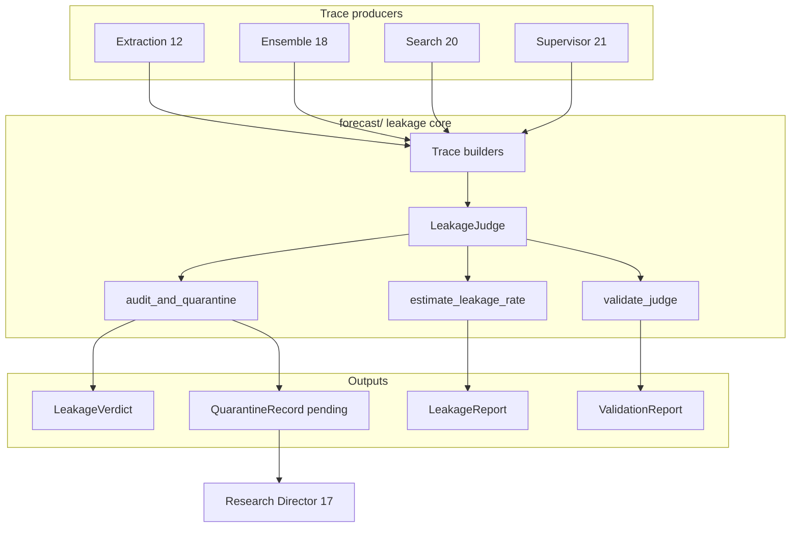

# Leakage Judge — Full Documentation (Prompt 22)

This document describes every component built in **Prompt 22** (system-wide defense-in-depth leakage judge). For the structural PIT guarantee it audits on top of, see the point-in-time store ([`../pit/`](../pit/)). Agentic search integration (prompt 20) and the Research Director that owns disposition (prompt 17) live at the application layer.

Prompt 22 generalizes the scoped leakage judge introduced in prompt 20 into a **reusable, validated, system-wide audit** over all forecast traces. The point-in-time store already makes leakage structurally impossible for clean ingested data; this judge is the detective layer **on top of** that guarantee — never a replacement.

Pipeline position (audit hooks on every trace-producing stage):

```
extraction (12) ──┐
ensemble (18)     ├──► Trace builders ──► LeakageJudge.audit ──► quarantine / batch report
search (20)       ──┤                              │
supervisor (21)   ──┘                              └──► Research Director (17) decides disposition
```

---

## Table of contents

1. [Mission and invariants](#1-mission-and-invariants)
2. [Architecture overview](#2-architecture-overview)
3. [Module map](#3-module-map)
4. [Core types (`forecast/leakage_judge.py`)](#4-core-types-forecastleakage_judgepy)
5. [Inline audit mode](#5-inline-audit-mode)
6. [Batch audit mode (`forecast/leakage_batch.py`)](#6-batch-audit-mode-forecastleakage_batchpy)
7. [Self-validation (`forecast/leakage_validation.py`)](#7-self-validation-forecastleakage_validationpy)
8. [Trace builders](#8-trace-builders)
9. [Integration by pipeline component](#9-integration-by-pipeline-component)
10. [Quarantine and disposition policy](#10-quarantine-and-disposition-policy)
11. [Re-export shim (application layer)](#11-re-export-shim-application-layer)
12. [End-to-end walkthrough](#12-end-to-end-walkthrough)
13. [Point-in-time contract](#13-point-in-time-contract)
14. [Testing: acceptance suite LJ1–LJ7](#14-testing-acceptance-suite-lj1lj7)
15. [What still needs to be done](#15-what-still-needs-to-be-done)
16. [Known limitations and improvements](#16-known-limitations-and-improvements)

---

## 1. Mission and invariants

### What this layer is for

Forecast quality depends on evidence and reasoning that are **knowable as of** the forecast's knowledge-time. The PIT store enforces that structurally for corpus reads (`knowledge_time ≤ as_of`). Two failure modes still slip through:

1. **Misdated documents** — a row with incorrect `knowledge_time` in the store
2. **Hallucinated future facts** — LLM reasoning references outcomes, dates, or events after `as_of`

The leakage judge is an LLM-as-judge (mockable via Protocol) that audits serialized evidence/reasoning **traces** and flags post-`as_of` references. It operates in two modes:

| Mode | When | Output |
|------|------|--------|
| **Inline** | At forecast time, per trace | `LeakageVerdict` + optional `QuarantineRecord` |
| **Batch** | Registry-wide or scheduled audit | `LeakageReport` with per-component rates + regression spikes |

### What this layer is NOT

| Forbidden pattern | Why |
|-------------------|-----|
| Replace structural PIT | Judge is defense-in-depth only; never skip PIT reads |
| Decide disposition | Re-extract / exclude / override is Research Director (17) territory |
| Act on forecasts downstream | No imports of downstream gating or serving layers |
| Tune for precision over recall | Unflagged traces must be reliably clean; noisy flags are acceptable |
| Live LLM in tests | All tests use `FixtureLeakageJudgeLLM` — deterministic, no network |

### Non-negotiable invariants

| Invariant | Meaning |
|-----------|---------|
| **High recall** | Catch nearly all leaks; accept over-flagging. Validated via `validate_judge()` with recall floor (default 0.95). |
| **Flag never downgraded** | Low `confidence` does not clear a flag; confidence is recorded only. |
| **One judge, system-wide** | Same `LeakageJudge` instance audits extraction, ensemble, search, and supervisor traces. |
| **Flag, don't decide** | Quarantine default; `disposition=pending` until Director (17) acts. |
| **Domain-agnostic core** | Canonical code in `forecast/`; application-specific trace builders (search, extraction) live at the application layer. |

---

## 2. Architecture overview

### Layer split (CLAUDE.md §11)

```
forecast/                          application layer
├── leakage_judge.py    ◄────────── leakage_judge re-export shim
├── leakage_validation.py            extraction + search trace builders
├── leakage_batch.py                 agentic search (inline audit wired)
├── trace_from_ensemble              wired — audited in forecaster/stages/leakage_gate.py
└── trace_from_supervisor            wired — audited in forecaster/stages/leakage_gate.py
                                     (both traces run through the leakage gate in forecaster/chain.py)
```

### Data flow



---

## 3. Module map

| File | Responsibility |
|------|----------------|
| [`forecast/leakage_judge.py`](leakage_judge.py) | Core types, `LeakageJudge`, `FixtureLeakageJudgeLLM`, inline quarantine, ensemble/supervisor trace builders |
| [`forecast/leakage_validation.py`](leakage_validation.py) | Labeled-set recall/precision; recall-floor gate |
| [`forecast/leakage_batch.py`](leakage_batch.py) | Batch leakage-rate estimation; regression surfacing |
| Application-layer trace builders | `trace_from_search`, `trace_from_extraction` |
| Application-layer re-export shim | Public API unchanged for existing consumers |
| Application-layer agentic search | **Only inline integration wired today** — calls `audit_and_quarantine` after search |

Public exports also surface from [`forecast/__init__.py`](__init__.py): `LeakageJudge`, `LeakageVerdict`, `Trace`, `TraceComponent`, `RegistrySlice`, `QuarantineRecord`, `validate_judge`, etc.

---

## 4. Core types (`forecast/leakage_judge.py`)

### `TraceComponent` (StrEnum)

Tags which pipeline stage produced a trace:

| Value | Producer prompt |
|-------|-----------------|
| `extraction` | 12 — source text extraction |
| `ensemble` | 18 — N-run forecast aggregation |
| `search` | 20 — agentic evidence gathering |
| `supervisor` | 21 — disagreement reconciliation |

### `Trace`

One auditable evidence/reasoning blob pinned at a knowledge-time ceiling.

| Field | Type | Description |
|-------|------|-------------|
| `component` | `TraceComponent` | Which stage produced this trace |
| `as_of` | `datetime` (UTC) | Knowledge-time ceiling for the audit |
| `text` | `str` | Serialized trace (typically JSON) passed to the LLM judge |
| `forecast_id` | `str` | Optional stable id for quarantine logging (default `""`) |
| `metadata` | `dict[str, Any]` | Opaque tags (e.g. `source_id`, `model_version`) |

Naive datetimes are rejected; `as_of` is normalized to UTC via `ensure_utc`.

### `LeakageVerdict`

Outcome of one audit. **Replaces** the prompt-20 shape `{passed, flags, trace_excerpt}` with:

| Field | Type | Description |
|-------|------|-------------|
| `flagged` | `bool` | `True` when post-`as_of` reference detected |
| `confidence` | `float` | Judge confidence in `[0, 1]` — recorded only, never downgrades a flag |
| `rationale` | `str` | Human/machine-readable explanation (e.g. `future_timestamp:2024-03-01T...`) |
| `component` | `TraceComponent` | Copied from input `Trace` by `LeakageJudge.audit` |
| `trace_excerpt` | `str` | First 500 chars of audited text (configurable via `DEFAULT_TRACE_EXCERPT_LEN`) |

### `RegistrySlice`

Batch audit input — a caller-supplied collection of traces (not read automatically from Postgres/registry today).

| Field | Type | Description |
|-------|------|-------------|
| `traces` | `tuple[Trace, ...]` | Traces to audit |
| `slice_id` | `str` | Label for logging and reports |

### `ComponentLeakageRate`

Per-component statistics inside a batch report.

| Field | Type | Description |
|-------|------|-------------|
| `component` | `TraceComponent` | Stage |
| `total` | `int` | Traces audited |
| `flagged` | `int` | Traces flagged |
| `rate` | `float` | `flagged / total` |

### `LeakageRegression`

A spike vs baseline for one component.

| Field | Type | Description |
|-------|------|-------------|
| `component` | `TraceComponent` | Stage with elevated rate |
| `current_rate` | `float` | Rate in current slice |
| `baseline_rate` | `float` | Rate in baseline slice (0 if no baseline) |
| `delta` | `float` | `current_rate - baseline_rate` |

### `LeakageReport`

Full batch output.

| Field | Type | Description |
|-------|------|-------------|
| `slice_id` | `str` | From input slice |
| `total` | `int` | Traces audited |
| `flagged` | `int` | Total flagged |
| `aggregate_rate` | `float` | Overall flagged fraction |
| `by_component` | `tuple[ComponentLeakageRate, ...]` | Per-stage breakdown |
| `regressions` | `tuple[LeakageRegression, ...]` | Spikes above threshold |

### `QuarantineRecord`

Conservative quarantine log for Research Director (17).

| Field | Type | Description |
|-------|------|-------------|
| `forecast_id` | `str` | From trace |
| `component` | `TraceComponent` | Stage that leaked |
| `as_of` | `datetime` | Knowledge-time ceiling |
| `verdict` | `LeakageVerdict` | Full audit outcome |
| `disposition` | `QuarantineDisposition` | Always `pending` when created by judge |

### `LeakageJudgeLLM` (Protocol)

Production implementations will call Haiku-class models (Bedrock Batch). Contract:

```python
@property
def model_version(self) -> str: ...

@property
def prompt_version(self) -> str: ...  # pin LEAKAGE_JUDGE_PROMPT_VERSION

def audit(self, trace: str, *, as_of: datetime) -> LeakageVerdict: ...
```

### `FixtureLeakageJudgeLLM`

Deterministic test double — **not** a production judge. Rules:

1. **Substring flags:** any `flag_substrings` entry appearing in trace → `substring:{needle}` in rationale
2. **Future ISO timestamps:** token scan for ISO-8601 datetimes strictly after `as_of` → `future_timestamp:{value}`

Configurable: `reject_future_iso_dates`, `flagged_confidence` (default 0.95), `clean_confidence` (default 0.99).

### `LeakageJudge`

Wrapper over `LeakageJudgeLLM`.

```python
judge = LeakageJudge(FixtureLeakageJudgeLLM())

verdict = judge.audit(trace, as_of=optional_override)
report = judge.estimate_leakage_rate(registry_slice, baseline=..., spike_threshold=0.05)
```

`audit()` passes `trace.text` to the LLM, then overwrites `component` and ensures `trace_excerpt` is populated.

### Helpers

| Function | Purpose |
|----------|---------|
| `render_trajectory(dict)` | Canonical JSON serialization for trajectory dicts |
| `trace_from_ensemble(EnsembleForecast)` | Build `Trace` from ensemble draws + provenance |
| `trace_from_supervisor(ReconciledForecast)` | Build `Trace` from reconciliation trajectory |
| `audit_and_quarantine(judge, trace)` | Inline audit + `QuarantineRecord` + `structlog` when flagged |

Constants: `LEAKAGE_JUDGE_PROMPT_VERSION = "leakage_judge_v1"`, `DEFAULT_TRACE_EXCERPT_LEN = 500`.

---

## 5. Inline audit mode

Inline mode runs at forecast time for each trace.

### Flow

1. Producer builds a `Trace` via the appropriate builder
2. `audit_and_quarantine(judge, trace)` calls `judge.audit(trace)`
3. If `verdict.flagged`:
   - Returns `(verdict, QuarantineRecord(disposition=pending))`
   - Emits `structlog` event `forecast_quarantined` with `forecast_id`, `component`, `rationale`
4. If clean: returns `(verdict, None)`

### Wired integration: agentic search (20)

The application layer's `AgenticSearcher.gather_evidence()`:

```python
trace = trace_from_search(trajectory_dict, as_of=as_of, forecast_id=fingerprint)
verdict, _quarantine = audit_and_quarantine(self._judge, trace, as_of=as_of)

bundle = EvidenceBundle(
    ...
    leakage_verdict=verdict,
    quarantined=verdict.flagged,
)
```

The quarantine record is returned from `audit_and_quarantine` but **not yet persisted** on the bundle — only logged. Downstream should treat `quarantined=True` as "exclude from production consumption until Director disposition."

### Not yet wired inline

Extraction, ensemble, and supervisor have trace builders but **do not** call `audit_and_quarantine` in their main code paths yet. See [§15](#15-what-still-needs-to-be-done).

---

## 6. Batch audit mode (`forecast/leakage_batch.py`)

Batch mode estimates aggregate leakage rates over a `RegistrySlice` and surfaces regressions.

### `estimate_leakage_rate(judge, slice, *, baseline=None, spike_threshold=0.05)`

1. Audits every trace in `slice.traces`
2. Computes `aggregate_rate = flagged / total`
3. Builds `by_component` rates for each `TraceComponent` with at least one trace
4. Detects **regressions**:
   - With `baseline`: component where `current_rate - baseline_rate > spike_threshold`
   - Without baseline: component where `current_rate > spike_threshold`
5. Logs `leakage_rate_estimated` (info) or `leakage_rate_regression` (warning)

Also callable via `LeakageJudge.estimate_leakage_rate()` (delegates to this module).

### Building a slice today

There is **no automatic slice loader**. Callers must:

1. Read cached trajectories from Postgres caches (`search_trajectory_cache`, `ensemble_cache`, `extraction_cache`) or in-memory fixtures
2. Convert each artifact to a `Trace` via the appropriate builder
3. Assemble `RegistrySlice(traces=(...), slice_id="2024-Q1")`

Example sketch:

```python
from core.forecast.leakage_judge import LeakageJudge, RegistrySlice, FixtureLeakageJudgeLLM
# trace_from_search is an application-layer builder (see §8)

judge = LeakageJudge(FixtureLeakageJudgeLLM())
traces = [
    trace_from_search(bundle.trajectory, as_of=bundle.as_of, forecast_id=bundle.task_fingerprint)
    for bundle in cached_bundles
]
baseline = judge.estimate_leakage_rate(RegistrySlice(traces=baseline_traces, slice_id="baseline"))
report = judge.estimate_leakage_rate(
    RegistrySlice(traces=traces, slice_id="current"),
    baseline=baseline,
    spike_threshold=0.05,
)
```

---

## 7. Self-validation (`forecast/leakage_validation.py`)

Before relying on unflagged traces in production, validate the judge like any classifier.

### `LabeledTrace`

| Field | Type | Description |
|-------|------|-------------|
| `trace` | `Trace` | Input trace |
| `is_leak` | `bool` | Ground truth — `True` if trace contains a leak |

### `ValidationReport`

| Field | Type | Description |
|-------|------|-------------|
| `recall` | `float` | `TP / (TP + FN)` |
| `precision` | `float` | `TP / (TP + FP)` — noisy precision is acceptable |
| `true_positives`, `false_positives`, `true_negatives`, `false_negatives` | `int` | Confusion matrix counts |
| `n` | `int` | Total labeled traces |
| `recall_floor` | `float` | Threshold used |
| `meets_recall_floor` | `bool` | Whether recall ≥ floor |

### `validate_judge(judge, labeled, *, recall_floor=0.95)`

1. Audits each labeled trace
2. Computes recall/precision
3. Logs `leakage_judge_validated` via structlog
4. Raises `ValueError` if recall < `recall_floor`

**No labeled production set exists yet** — tests use inline fixtures. Building a curated labeled corpus (misdated docs, hallucinated outcomes, clean traces) is setup work.

---

## 8. Trace builders

### Core (`forecast/leakage_judge.py`)

| Builder | Input | Serialized content |
|---------|-------|-------------------|
| `trace_from_ensemble` | `EnsembleForecast` | probability, uncertainty, n, aggregator, knowledge_time, all draws + provenance |
| `trace_from_supervisor` | `ReconciledForecast` | probability, applied, confidence, trajectory dict, provenance |

Both set `as_of = knowledge_time` and `component` appropriately.

### Application layer (not part of core)

| Builder | Input | Serialized content |
|---------|-------|-------------------|
| `trace_from_search` | trajectory dict + `as_of` | Full search trajectory JSON via `render_trajectory` |
| `trace_from_extraction` | extracted records + source doc | source metadata + all extracted records |

---

## 9. Integration by pipeline component

| Component | Trace builder | Inline audit wired? | Batch-ready? |
|-----------|---------------|---------------------|--------------|
| Extraction (12) | `trace_from_extraction` | **No** | Yes (manual slice) |
| Ensemble (18) | `trace_from_ensemble` | **No** | Yes (manual slice) |
| Search (20) | `trace_from_search` | **Yes** — application search loop | Yes — `EvidenceBundle.trajectory` cached |
| Supervisor (21) | `trace_from_supervisor` | **No** | Yes — `ReconciledForecast.trajectory` cached |

### Verdict shape migration (prompt 20 → 22)

| Old (prompt 20) | New (prompt 22) |
|-----------------|-----------------|
| `verdict.passed` | `not verdict.flagged` |
| `verdict.flags` | Parse `verdict.rationale` (semicolon-separated codes) |
| — | `verdict.confidence` |
| — | `bundle.quarantined` |

---

## 10. Quarantine and disposition policy

### Policy

| Actor | Responsibility |
|-------|----------------|
| **Leakage judge** | Flag + conservative quarantine; log `QuarantineRecord(disposition=pending)` |
| **Research Director (17)** | Decide: re-extract, permanently exclude, or override (with audit trail) |
| **Downstream consumers** | Exclude `quarantined=True` forecasts by default |

The judge **never**:

- Re-runs extraction or search
- Permanently deletes a forecast
- Overrides a flag based on low confidence
- Gates or reroutes downstream consumption itself

### Logging

Flagged inline audits emit:

```
forecast_quarantined  forecast_id=...  component=search  rationale=...  disposition=pending
```

Batch regressions emit:

```
leakage_rate_regression  slice_id=...  regressions=[{component, current_rate, baseline_rate, delta}]
```

### Disposition states (future)

Only `pending` exists today. Director (17) should eventually append disposition transitions (`re_extract`, `exclude`, `override`) to the registry — not implemented.

---

## 11. Re-export shim (application layer)

Prompt 20 placed the judge at the application ingest layer. Prompt 22 moved the canonical implementation to `forecast/` (domain-agnostic core). An application-layer module can remain as a thin shim:

```python
from core.forecast.leakage_judge import (
    FixtureLeakageJudgeLLM,
    LeakageJudge,
    LeakageJudgeLLM,
    LeakageVerdict,
    render_trajectory,
)
```

Existing application-layer imports continue to work through the shim. New code should prefer `from core.forecast.leakage_judge import ...`.

---

## 12. End-to-end walkthrough

### Inline: agentic search with clean trace (application layer, illustrative)

```python
from core.forecast.leakage_judge import FixtureLeakageJudgeLLM, LeakageJudge
from core.pit.store import InMemoryPitStore

store = InMemoryPitStore()
# ... seed corpus ...
judge = LeakageJudge(FixtureLeakageJudgeLLM())
searcher = AgenticSearcher(store, search_llm, cache, judge)  # application search loop

task = ForecastTask(question="Will the incumbent win the 2026 election?", as_of=as_of)
bundle = searcher.gather_evidence(task, budget=QueryBudget(max_queries=3))

assert bundle.leakage_verdict is not None
assert bundle.leakage_verdict.flagged is False
assert bundle.quarantined is False
```

### Inline: leaked reasoning in search step

If the search LLM's `reasoning` field contains an ISO timestamp after `as_of`, the fixture judge flags it:

```python
# FixtureSearchStep(reasoning="References outcome on 2024-03-01T12:00:00+00:00")
assert bundle.leakage_verdict.flagged is True
assert "future_timestamp" in bundle.leakage_verdict.rationale
assert bundle.quarantined is True
```

### Batch: compare current slice to baseline

```python
from core.forecast.leakage_judge import LeakageJudge, RegistrySlice, FixtureLeakageJudgeLLM

judge = LeakageJudge(FixtureLeakageJudgeLLM(flag_substrings=("LEAK",)))
baseline = judge.estimate_leakage_rate(RegistrySlice(traces=clean_traces, slice_id="v1"))
report = judge.estimate_leakage_rate(
    RegistrySlice(traces=mixed_traces, slice_id="v2"),
    baseline=baseline,
    spike_threshold=0.1,
)
if report.regressions:
    print("Leakage regression detected:", report.regressions)
```

### Validation: gate a judge before deployment

```python
from core.forecast.leakage_validation import LabeledTrace, validate_judge

report = validate_judge(judge, labeled_fixtures, recall_floor=0.95)
print(f"recall={report.recall:.2f} precision={report.precision:.2f}")
```

---

## 13. Point-in-time contract

| Rule | Enforcement |
|------|-------------|
| Audit uses `trace.as_of` as knowledge-time ceiling | `LeakageJudge.audit` defaults to `trace.as_of` |
| Judge checks text for references **after** `as_of` | LLM / fixture rules |
| Trace builders pin `as_of` to producer knowledge_time | ensemble/supervisor: `knowledge_time`; extraction: `doc.published_at`; search: task `as_of` |
| Judge does not read future PIT rows | Judge only sees serialized text — no store access |
| UTC only | All datetimes validated via `ensure_utc` |

The judge **does not** re-validate that corpus evidence has `knowledge_time ≤ as_of` — that is the structural guarantee in `AsOfSearch` / `PitStore.corpus_as_of`. The judge catches what structure misses in the **reasoning layer**.

---

## 14. Testing: acceptance suite LJ1–LJ7

Judge behavior is exercised through the paths that consume it — the forecaster's
leakage gate (`tests/forecaster/test_leakage_gate.py`) and the evaluation-suite
leakage audit (`tests/evaluation/test_leakage_audit.py`). All use
`FixtureLeakageJudgeLLM` — no live LLM.

| ID | File | Behavior asserted |
|----|------|-------------------|
| **LJ1** | `tests/forecaster/test_leakage_gate.py` | Planted post-as-of leak in a pipeline trace is flagged; clean traces pass unflagged |
| **LJ4** | `tests/forecaster/test_leakage_gate.py` | Flagged trace → forecast quarantined (and `tests/forecaster/test_chain_e2e.py` proves a quarantined forecast still writes a complete record) |
| **LJ5** | `tests/evaluation/test_leakage_audit.py` | Suite-level leakage rate + clean fraction computed; all-clean suite yields zero rate; audit report renders the rate |

The remaining LJ2/LJ3/LJ6/LJ7 acceptance behaviors (recall/precision validation
harness, multi-producer trace audits, misdated-doc defense-in-depth, determinism
as a standalone suite) do not yet have dedicated test files.

Run:

```bash
uv run pytest tests/forecaster/test_leakage_gate.py tests/evaluation/test_leakage_audit.py
```

---

## 15. What still needs to be done

These items are **in scope for prompt 22's design** but **not yet implemented** in production wiring:

### Production LLM judge

| Item | Status |
|------|--------|
| Bedrock judge implementing `LeakageJudgeLLM` | **Built + wired** — `BedrockLeakageJudgeLLM` (`core/forecast/leakage_judge.py`), injected into the forecaster's leakage gate via `_default_forecaster()` in `common/cli.py`; `FixtureLeakageJudgeLLM` remains the hermetic test double |
| Prompt template file for `leakage_judge_v1` | Constant exists; no template artifact |
| Content-addressed cache of judge outputs (like extraction/search caches) | Not built |
| Batch API integration for high-volume audits | Not built |

### Inline wiring (remaining producers)

| Producer | Action needed |
|----------|---------------|
| **Extraction (12)** | Call `audit_and_quarantine` after the application's extraction step; attach verdict to its extraction result |
| **Ensemble (18)** | **Wired** — `forecaster/stages/leakage_gate.py` audits `trace_from_ensemble` in the pipeline; flagged forecasts are quarantined |
| **Supervisor (21)** | **Wired** — `forecaster/stages/leakage_gate.py` audits `trace_from_supervisor` after reconciliation; flagged forecasts are quarantined |

### Quarantine → Research Director (17)

| Item | Status |
|------|--------|
| `QuarantineRecord` persisted to registry | Not built — structlog only |
| Director consumes quarantine queue | Not built — no input on `ResearchDirector.direct()` |
| Disposition enum expansion (`re_extract`, `exclude`, `override`) | Not built |
| Exclusion of quarantined forecasts enforced in downstream consumers | Policy documented; not enforced in code |

### Batch infrastructure

| Item | Status |
|------|--------|
| `RegistrySlice` loader from Postgres caches | Manual assembly required |
| Scheduled batch job (EventBridge / orchestrator loop) | Not built |
| Baseline report storage for regression comparison | Not built |
| Dashboard surfacing of `LeakageReport` | Not built |

### Validation corpus

| Item | Status |
|------|--------|
| Curated labeled fixture set (≥50 traces, planted leaks) | Tests use small inline fixtures only |
| CI gate: `validate_judge()` must pass before judge prompt version bump | Not wired |
| Record `ValidationReport` to registry on judge version change | Not built |

### Documentation / ops

| Item | Status |
|------|--------|
| Runbook for Director disposition of quarantined forecasts | Not written |
| Alert routing on `leakage_rate_regression` | structlog only — no CloudWatch alarm |

---

## 16. Known limitations and improvements

### Current limitations

1. **Fixture judge ≠ production judge.** Substring and ISO-token scanning catches test-planted leaks but misses nuanced leakage (implicit future knowledge, relative dates like "last week's announcement").

2. **ISO timestamp scan is naive.** Token-splitting misses timestamps embedded in prose without `T` separator; may false-positive on non-date strings containing `T`.

3. **Quarantine record discarded in search path.** `AgenticSearcher` calls `audit_and_quarantine` but binds `_quarantine` — the record is logged, not stored on `EvidenceBundle`.

4. **No verdict on cached search hits.** Cache hits return the stored `leakage_verdict` from first run — correct for reproducibility, but judge version bumps won't re-audit cached trajectories automatically.

5. **Batch slice is manual.** No helper to walk `search_trajectory_cache`, `ensemble_cache`, and `extraction_cache` tables into a `RegistrySlice`.

6. **Regression detection is rate-only.** No statistical test (e.g. binomial CI); fixed `spike_threshold` may be too sensitive or too blunt.

7. **Single global recall floor.** Component-specific floors (search may need higher recall than ensemble) not supported.

8. **Confidence unused downstream.** Recorded but not propagated to uncertainty haircuts or Director prioritization.

### Recommended improvements

| Improvement | Rationale |
|-------------|-----------|
| **Production LLM judge with explicit prompt** | Flag future dates, resolved outcomes, post-cutoff events, "already happened" language |
| **Judge output cache** | Content-addressed by `(trace_hash, judge_model, judge_prompt)` for reproducibility |
| **Attach `QuarantineRecord` to bundles/results** | Director and registry need structured records, not just logs |
| **Wire all four producers inline** | Defense-in-depth is only as strong as the weakest unwired stage |
| **RegistrySlice builder** | SQL query over cache tables → traces; enables one-command batch audit |
| **Re-audit on judge version bump** | Background job re-scans cached trajectories when `prompt_version` changes |
| **Labeled validation corpus in repo** | `tests/fixtures/leakage_labeled.jsonl` + CI recall gate |
| **Component-specific spike thresholds** | Search historically noisier; ensemble should be near zero |
| **Integrate with meta-layer anomaly flags** | Map `leakage_rate_regression` → `AnomalyKind.LEAKAGE_SPIKE` for Director |
| **Downstream kill switch** | Hard-block consumption of `quarantined=True` forecasts until disposition |
| **Richer rationale schema** | Structured `flags: list[LeakageFlag]` alongside free-text rationale for tooling |

---

## Quick reference

```python
# Imports
from core.forecast.leakage_judge import (
    LeakageJudge, Trace, TraceComponent, RegistrySlice,
    FixtureLeakageJudgeLLM, audit_and_quarantine,
    trace_from_ensemble, trace_from_supervisor,
)
from core.forecast.leakage_validation import LabeledTrace, validate_judge
# trace_from_search / trace_from_extraction: application-layer builders (§8)

# Inline
verdict, quarantine = audit_and_quarantine(judge, trace)

# Batch
report = judge.estimate_leakage_rate(slice, baseline=baseline)

# Validate
report = validate_judge(judge, labeled, recall_floor=0.95)
```
