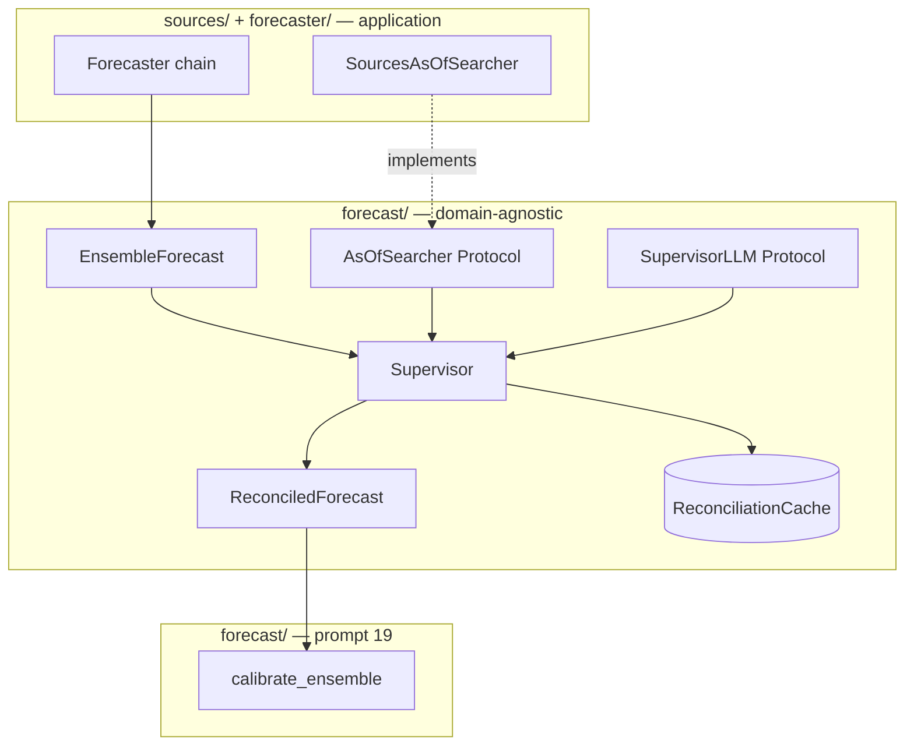
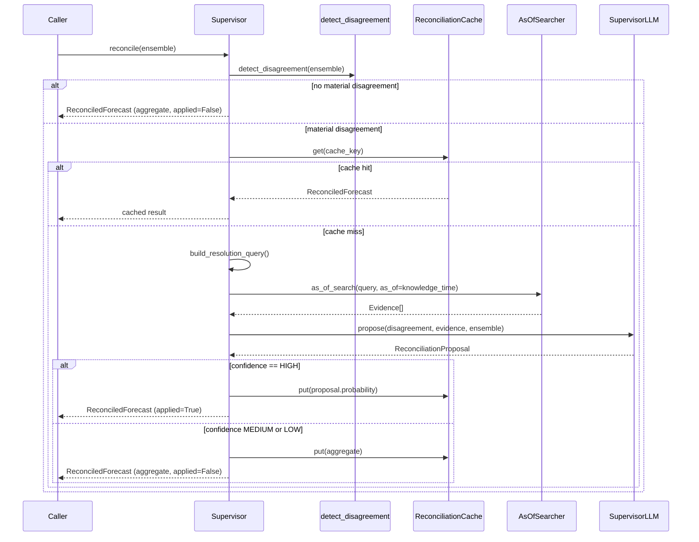

# Forecast Supervisor — Full Documentation

This document describes every component built in **Prompt 21** (disciplined disagreement-resolving supervisor for forecast ensembles). For a one-page quick start, see [§12 End-to-end walkthrough](#12-end-to-end-walkthrough). For the ensemble it reconciles, see [DOCUMENTATION.md](DOCUMENTATION.md) (prompt 18).

Prompt 21 addresses the highest-risk upgrade in the forecast pipeline: **LLM reconciliation of ensemble disagreements**. Research shows the naive version — asking an LLM to "pick the best" or "blend" forecasts — **actively underperforms the median** by over-weighting outliers. This module builds only the disciplined version: identify the disagreement, resolve it with targeted as-of search, and apply the update **only** when confidence is high; otherwise fall back to the robust aggregate.

Pipeline position in the full forecast stack:

```
agentic search (20) → ENSEMBLE (18) → SUPERVISOR (21) → calibrate (19) → downstream consumers
```

This document covers **supervisor reconciliation (21)** and the **domain-agnostic as-of search seam** (`forecast/search.py`) lifted from prompt 20 for core/specialized separation. Ensemble aggregation and calibration are separate prompts.

---

## Table of contents

1. [Mission and invariants](#1-mission-and-invariants)
2. [Architecture overview](#2-architecture-overview)
3. [Module map](#3-module-map)
4. [Domain-agnostic as-of search seam (`forecast/search.py`)](#4-domain-agnostic-as-of-search-seam-forecastsearchpy)
5. [Supervisor module (`forecast/supervisor.py`)](#5-supervisor-module-forecastsupervisorpy)
6. [Disagreement detection](#6-disagreement-detection)
7. [Targeted resolution query](#7-targeted-resolution-query)
8. [Reconcile flow and confidence gate](#8-reconcile-flow-and-confidence-gate)
9. [Reconciliation cache](#9-reconciliation-cache)
10. [Application integration (`sources/`, `forecaster/`)](#10-application-integration-sources-forecaster)
11. [Calibration hand-off](#11-calibration-hand-off)
12. [End-to-end walkthrough](#12-end-to-end-walkthrough)
13. [Point-in-time contract](#13-point-in-time-contract)
14. [Provenance and reproducibility model](#14-provenance-and-reproducibility-model)
15. [Testing: acceptance suite SU1–SU8](#15-testing-acceptance-suite-su1su8)
16. [What still needs to be done](#16-what-still-needs-to-be-done)
17. [Known limitations and improvements](#17-known-limitations-and-improvements)

---

## 1. Mission and invariants

### What this layer is for

After prompt 18 runs N independent forecast draws and aggregates them robustly (median or trimmed mean), the ensemble may still contain **material disagreement** — some runs anchored on different evidence, base rates, or interpretations. A single robust aggregate discards that disagreement without resolving it.

The supervisor's job is to **reconcile** that disagreement when it is substantive:

1. Detect when the draw distribution shows real conflict (not just noise)
2. Issue a **targeted** as-of search query aimed at the specific dispute
3. Ask the supervisor LLM to propose a reconciled probability with a confidence label
4. Apply the proposal **only** at `HIGH` confidence; otherwise return the robust aggregate unchanged

The supervisor can **improve on** the median or **equal** it — it is structurally prevented from doing worse (the median floor).

### What this layer is NOT

| Forbidden pattern | Why |
|-------------------|-----|
| "Pick the best" run | Over-weights outliers; empirically underperforms median |
| "Blend all" runs via LLM | Same failure mode — LLM combiner underperforms robust stats |
| Touch downstream decision paths | Calibration math and downstream consumers stay deterministic and LLM-free |
| Unbounded re-search | One targeted query per reconciliation; trajectory cached |
| Modify `ForecastDraw` | That is prompt 18's contract; supervisor reads provenance read-only |

### Non-negotiable invariants

| Invariant | Meaning |
|-----------|---------|
| **No naive aggregation** | No pick-best or blend-all code path exists. Only disagreement → search → confidence gate. |
| **Median floor** | Any non-`HIGH` confidence path returns `ensemble.probability` unchanged. `ReconciledForecast.aggregate_probability` always records the floor. |
| **Forecast layer only** | `forecast/supervisor.py` never imports application or downstream-consumer layers. Boundary enforced by SU5 tests. |
| **As-of search seam** | Resolution search uses `AsOfSearcher` injected at construction. The application `SourcesAsOfSearcher` implements the Protocol; alternative backends can be injected against the same interface. |
| **Cached trajectory** | Reconciliation decisions are content-addressed and cached. The cache is the data of record. |
| **Domain-agnostic core** | Returns a generic `ReconciledForecast`. Application layers wrap and wire. |

---

## 2. Architecture overview

### Layer split (CLAUDE.md §5)

The supervisor lives in the **domain-agnostic core** (`forecast/`). It depends only on:

- `forecast.ensemble` — input `EnsembleForecast`
- `forecast.search` — `AsOfSearcher` Protocol + `Evidence`
- `core.pit.models` — UTC normalization (shared infrastructure)
- `core.registry.fingerprint` — content hashing for cache keys

Application wiring injects the concrete `SourcesAsOfSearcher` from `sources/searcher.py`. Dependency direction is **specialized → core** only.



### Reconcile sequence (cache miss, material disagreement)



---

## 3. Module map

```
forecast/
├── search.py              Evidence, AsOfSearcher, FixtureAsOfSearch (prompt 21 seam)
├── supervisor.py          Supervisor, ReconciledForecast, disagreement + cache (prompt 21)
├── ensemble.py            EnsembleForecast input (prompt 18)
├── calibration.py         calibrate_ensemble consumer (prompt 19)
└── SUPERVISOR_DOCUMENTATION.md   This file

sources/
└── searcher.py            SourcesAsOfSearcher — implements AsOfSearcher over the as-of snapshot corpus

forecaster/
└── chain.py               Forecaster — produces EnsembleForecast and runs the supervisor

tests/forecast/
├── test_search.py         Evidence + FixtureAsOfSearch §8
└── test_supervisor.py     SU1–SU8 acceptance suite
```

---

## 4. Domain-agnostic as-of search seam (`forecast/search.py`)

Prompt 21 lifted the search interface into the forecast core so the supervisor can depend on a Protocol without importing application code.

### 4.1 `Evidence`

One retrieved snippet pinned at or before the forecast as-of.

| Field | Type | Meaning |
|-------|------|---------|
| `snippet` | `str` | Excerpt from the source document |
| `source` | `str` | Domain-agnostic source label (e.g. `"web"`, `"tavily"`, `"hosted"`) |
| `source_id` | `str` | Stable identifier within the source |
| `knowledge_time` | `datetime` | When this snippet was knowable (must be UTC-aware) |
| `score` | `float` | Relevance score ≥ 0 |
| `query` | `str` | Query that retrieved this evidence |

**As-of contract:** `knowledge_time` must be ≤ the `as_of` passed to `as_of_search`. Naive datetimes are rejected at validation.

### 4.2 `AsOfSearcher` (Protocol)

```python
def as_of_search(self, query: str, *, as_of: datetime) -> Sequence[Evidence]:
    """Return evidence with knowledge_time <= as_of only."""
```

Any backend that satisfies this signature can be injected:

| Implementation | Location | Corpus |
|----------------|----------|--------|
| `SourcesAsOfSearcher` | `sources/searcher.py` | Point-in-time web snapshots (hosted providers + snapshot store) |
| `FixtureAsOfSearch` | `forecast/search.py` | Scripted responses for tests |

### 4.3 `FixtureAsOfSearch`

Deterministic test double. Maps normalized query strings to scripted `Evidence` sequences. Records `call_count` and `queries` for assertion in tests.

### 4.4 Application `Evidence` reuse

The application search layer (`sources/`) builds and returns the core `Evidence` type from `forecast.search` directly. The core type uses `source: str` so any backend can reuse the same model.

---

## 5. Supervisor module (`forecast/supervisor.py`)

### 5.1 Constants

| Name | Default | Purpose |
|------|---------|---------|
| `SUPERVISOR_PROMPT_VERSION` | `"supervisor_v1"` | Prompt version for cache keys |
| `DEFAULT_SPREAD_THRESHOLD` | `0.15` | Std above which spread alone triggers disagreement |
| `DEFAULT_OUTLIER_STD_MULTIPLIER` | `1.5` | Outlier distance = k × ensemble std |
| `DEFAULT_MULTIMODAL_GAP` | `0.3` | Minimum gap between sorted clusters |
| `DEFAULT_MIN_CLUSTER_SIZE` | `2` | Minimum draws per cluster for multimodality |

### 5.2 `Confidence` (StrEnum)

| Value | Meaning | Gate behavior |
|-------|---------|---------------|
| `HIGH` | Supervisor is confident the proposal resolves the disagreement | Proposal probability **replaces** aggregate |
| `MEDIUM` | Partial confidence | **Discarded** — fallback to aggregate |
| `LOW` | Low confidence | **Discarded** — fallback to aggregate |

Only `HIGH` passes the confidence gate. This is a structural policy, not outcome-fitted.

### 5.3 `DisagreementKind` (StrEnum)

| Value | Trigger |
|-------|---------|
| `MULTIMODAL` | Bimodal cluster split (highest priority) |
| `OUTLIER` | One or more draws far from aggregate |
| `SPREAD` | Ensemble std above threshold |
| `NONE` | No material disagreement — skip resolution |

Priority order: multimodal > outlier > spread > none.

### 5.4 `Disagreement` (dataclass)

Summary of detected conflict across ensemble draws.

| Field | Type | Meaning |
|-------|------|---------|
| `kind` | `DisagreementKind` | Which heuristic triggered |
| `spread` | `float` | `ensemble.uncertainty` (sample std) |
| `aggregate_probability` | `float` | Robust aggregate (median floor) |
| `outlier_indices` | `tuple[int, ...]` | Run indices beyond k×std from aggregate |
| `cluster_low` | `float \| None` | Upper bound of low cluster (multimodal) |
| `cluster_high` | `float \| None` | Lower bound of high cluster (multimodal) |
| `largest_gap` | `float` | Largest gap between consecutive sorted draws |

`material` property: `True` when `kind != NONE`.

### 5.5 `ReconciliationProposal`

LLM output before the confidence gate.

| Field | Type | Constraints |
|-------|------|-------------|
| `probability` | `float` | [0, 1] |
| `confidence` | `Confidence` | HIGH / MEDIUM / LOW |
| `reasoning` | `str` | Audit trail (not used for aggregation) |

### 5.6 `ReconciledForecast`

Generic supervisor output — the hand-off type to calibration (19).

| Field | Type | Meaning |
|-------|------|---------|
| `probability` | `float` | Final point estimate (aggregate or HIGH-confidence update) |
| `uncertainty` | `float` | Passthrough from `ensemble.uncertainty` (unchanged) |
| `aggregate_probability` | `float` | Always the robust median floor |
| `confidence` | `Confidence` | Confidence of the applied decision |
| `applied` | `bool` | `True` only when HIGH-confidence proposal replaced aggregate |
| `knowledge_time` | `datetime` | From ensemble (forecast as-of ceiling) |
| `disagreement` | `DisagreementKind` | What kind of conflict was detected |
| `trajectory` | `dict` | Full audit record (query, evidence, proposal) |
| `provenance` | `dict` | Method, fallback reason, cached flag, etc. |

### 5.7 `SupervisorLLM` (Protocol)

```python
def propose(
    self,
    *,
    disagreement: Disagreement,
    evidence: Sequence[Evidence],
    ensemble: EnsembleForecast,
) -> ReconciliationProposal:
    """Propose a reconciled probability with confidence — never blend/pick-best."""
```

Production will implement this with a structured JSON prompt. Tests use `FixtureSupervisorLLM`.

### 5.8 `FixtureSupervisorLLM`

Deterministic test double. Maps `disagreement.kind.value` (e.g. `"multimodal"`) to scripted `FixtureSupervisorResponse`. Tracks `call_count`.

### 5.9 `Supervisor`

Main entry point. Constructor dependencies:

| Dependency | Type | Role |
|------------|------|------|
| `search` | `AsOfSearcher` | Targeted as-of resolution search |
| `llm` | `SupervisorLLM` | Proposal + confidence |
| `cache` | `ReconciliationCache` | Trajectory + decision persistence |

Configurable thresholds mirror `detect_disagreement` defaults.

#### `reconcile(ensemble: EnsembleForecast) -> ReconciledForecast`

The canonical contract from prompt 21. See [§8](#8-reconcile-flow-and-confidence-gate) for the full decision tree.

### 5.10 Utility functions

| Function | Purpose |
|----------|---------|
| `detect_disagreement(ensemble, **thresholds)` | Pure disagreement detection over draw distribution |
| `build_resolution_query(ensemble, disagreement)` | Targeted query string for as-of search |
| `build_supervisor_config(**thresholds)` | Serialize thresholds for cache key |
| `reconciliation_to_audit_dict(forecast)` | Canonical JSON for reproducibility checks |

---

## 6. Disagreement detection

`detect_disagreement()` operates on the **distribution of N draw probabilities** from prompt 18. It does **not** modify `ForecastDraw` or require free-text reasoning traces.

### 6.1 Outlier detection

When `ensemble.uncertainty > 0`:

```
threshold = outlier_std_multiplier × spread   # default: 1.5 × std
outlier if |draw.probability - aggregate| > threshold
```

Outlier run indices are recorded for targeted query building.

### 6.2 Multimodality heuristic

With N ≈ 10, a rigorous multimodality test is overkill. The supervisor uses a **pragmatic gap heuristic**:

1. Sort all draw probabilities
2. Find the largest gap between consecutive values
3. If `largest_gap >= multimodal_gap` (default 0.3) **and** both resulting clusters have ≥ `min_cluster_size` (default 2) members → `MULTIMODAL`

Example: draws `[0.15, 0.18, 0.82, 0.85, 0.88]` → gap 0.64 between 0.18 and 0.82 → multimodal.

### 6.3 Spread-only trigger

If not multimodal and no outliers, but `ensemble.uncertainty > spread_threshold` (default 0.15) → `SPREAD`.

### 6.4 Priority and early exit

```
if multimodal:     kind = MULTIMODAL
elif outliers:     kind = OUTLIER
elif spread high:  kind = SPREAD
else:             kind = NONE
```

When `kind == NONE`, `reconcile()` returns immediately with the aggregate — **no search, no LLM call**. This is cheap and preserves the median floor by construction.

### 6.5 Reading per-run provenance (read-only)

`ForecastDraw.provenance` may carry `rationale` or `reference_class` from upstream prompts (20, 24). The supervisor reads these **read-only** when building outlier-targeted queries. If absent, it degrades gracefully to generic reference-class wording. It never adds fields to `ForecastDraw`.

---

## 7. Targeted resolution query

`build_resolution_query(ensemble, disagreement)` constructs a single targeted query for `as_of_search`.

### Query templates by disagreement kind

| Kind | Query pattern |
|------|---------------|
| `MULTIMODAL` | `{question} resolve bimodal disagreement clusters {low}/{high}` |
| `OUTLIER` | `{question} outlier evidence {rationale1; rationale2; ...}` or `outlier runs at indices [...]` |
| `SPREAD` | `{question} high ensemble spread {spread:.3f}` |
| `NONE` | `{question}` or `"forecast reference class"` |

The `question` is read from `ensemble.provenance["question"]` when present. Application wiring is responsible for threading the question into ensemble provenance.

---

## 8. Reconcile flow and confidence gate

### Decision tree

```
reconcile(ensemble)
│
├─ detect_disagreement()
│
├─ [NONE] → return aggregate (applied=False, no search)
│
├─ [material] → cache lookup
│   ├─ hit → return cached (provenance.cached=True)
│   └─ miss ↓
│
├─ build_resolution_query()
├─ as_of_search(query, as_of=ensemble.knowledge_time)
├─ assert all evidence.knowledge_time <= as_of
├─ llm.propose(disagreement, evidence, ensemble)
│
├─ confidence != HIGH → fallback to aggregate (applied=False)
│                         (proposal recorded in trajectory/provenance)
│
└─ confidence == HIGH → apply proposal.probability (applied=True)
```

### Median floor guarantee

The floor is **structural**, not empirical:

- Fallback paths always set `probability = ensemble.probability`
- `aggregate_probability` always equals the robust aggregate
- Only `applied=True` with `confidence=HIGH` can change the point estimate

This is the answer to the naive-supervisor failure mode: the supervisor can improve on the median or defer to it; it cannot do worse by construction.

### What is explicitly NOT done

- No averaging of draw probabilities
- No selection of a single "best" draw
- No LLM-weighted blend of all runs
- No second ensemble pass

---

## 9. Reconciliation cache

### 9.1 `ReconciliationCacheKey`

Content-addressed key:

| Component | Source |
|-----------|--------|
| `ensemble_fingerprint` | SHA-256 of canonical JSON over ensemble fields + all draws + provenance |
| `supervisor_model_version` | `SupervisorLLM.model_version` |
| `supervisor_prompt_version` | `SupervisorLLM.prompt_version` |
| `search_config` | Serialized disagreement thresholds via `build_supervisor_config()` |

Identical ensemble + model + thresholds → cache hit → no re-search, no re-LLM.

### 9.2 `ReconciliationCache` (ABC)

| Method | Contract |
|--------|----------|
| `get(key)` | Return cached `ReconciledForecast` or `None` |
| `put(key, forecast)` | Append-only; identical keys are idempotent (first write wins) |

### 9.3 `InMemoryReconciliationCache`

In-process dict for tests and local development. Exposes `.keys` for inspection.

### 9.4 What is NOT cached separately

There is **no `PostgresReconciliationCache` yet**. Production persistence is a setup item (see §16).

### 9.5 Trajectory contents

On cache miss with material disagreement, `trajectory` records:

```json
{
  "skipped": false,
  "query": "...",
  "as_of": "2024-02-01T12:00:00+00:00",
  "disagreement": { "kind": "multimodal", "spread": 0.35, ... },
  "evidence": [ { "snippet": "...", "source": "web", ... } ],
  "proposal": { "probability": 0.72, "confidence": "high", "reasoning": "..." }
}
```

On no-disagreement skip: `{ "skipped": true, "reason": "no_material_disagreement", ... }`.

---

## 10. Application integration (`sources/`, `forecaster/`)

The supervisor is domain-agnostic. Application wiring is the caller's responsibility.

### Current state

| Component | Status |
|-----------|--------|
| `SourcesAsOfSearcher` implements `AsOfSearcher` | Done — structural Protocol satisfaction |
| Core `Evidence` used by the sources layer | Done |
| `Forecaster` chain calls supervisor | Wired via `forecaster/stages/aggregate.py` |
| Postgres reconciliation cache | **Not built** |

### Recommended application wiring

```python
from sources.searcher import SourcesAsOfSearcher
from forecast import Supervisor, InMemoryReconciliationCache

search = SourcesAsOfSearcher(...)
supervisor = Supervisor(search, production_supervisor_llm, cache)

# After the forecaster produces an ensemble:
ensemble = ...  # EnsembleForecast from cache or build_ensemble
reconciled = supervisor.reconcile(ensemble)

# Thread question into provenance for targeted queries:
# ensemble.provenance["question"] = "Will candidate X win the 2028 election?"
```

The application layer injects the searcher, threads the intake question into ensemble provenance, and hands `ReconciledForecast` to calibration.

---

## 11. Calibration hand-off

The supervisor sits **before** calibration (19) in the CLAUDE.md §3 pipeline.

### Correct chaining

```python
from forecast import Supervisor, calibrate_ensemble, build_ensemble

reconciled = supervisor.reconcile(ensemble)

# Build a synthetic EnsembleForecast for calibration input:
# (calibrate_ensemble expects EnsembleForecast today)
reconciled_ensemble = EnsembleForecast(
    probability=reconciled.probability,
    uncertainty=reconciled.uncertainty,
    n=ensemble.n,
    aggregator=ensemble.aggregator,
    trim_fraction=ensemble.trim_fraction,
    knowledge_time=ensemble.knowledge_time,
    draws=ensemble.draws,
    provenance={
        **dict(ensemble.provenance),
        "supervisor_applied": reconciled.applied,
        "supervisor_aggregate": reconciled.aggregate_probability,
    },
)
calibrated = calibrate_ensemble(reconciled_ensemble)
```

### What downstream consumers receive

| Field | Source | Use |
|-------|--------|-----|
| `calibrated.calibrated_probability` | calibrate(reconciled.probability) | Calibrated point estimate |
| `calibrated.ensemble_uncertainty` | passthrough from ensemble std | Stability haircut (prompt 23) |
| `reconciled.applied` | supervisor | Optional monitoring: how often supervisor overrides median |
| `reconciled.aggregate_probability` | supervisor | Audit: what the floor was |

Downstream consumers must **not** apply a second extremization or re-run the supervisor.

---

## 12. End-to-end walkthrough

### Test fixture example (no network)

```python
from datetime import UTC, datetime

from forecast import (
    Confidence,
    FixtureAsOfSearch,
    FixtureSupervisorLLM,
    FixtureSupervisorResponse,
    InMemoryReconciliationCache,
    Supervisor,
    build_ensemble,
)
from forecast.llm import ForecastDraw

T_AS_OF = datetime(2024, 2, 1, 12, 0, tzinfo=UTC)

# 1. Build a bimodal ensemble (material disagreement)
draws = [
    ForecastDraw(probability=p, run_index=i, model_version="m1", prompt_version="p1")
    for i, p in enumerate([0.15, 0.18, 0.82, 0.85, 0.88])
]
ensemble = build_ensemble(draws, aggregator="median", knowledge_time=T_AS_OF)
ensemble = ensemble.__class__(
    **{**ensemble.__dict__, "provenance": {**dict(ensemble.provenance), "question": "Will the product launch by Q3?"}}
)

# 2. Wire supervisor with fixtures
supervisor = Supervisor(
    search=FixtureAsOfSearch(),
    llm=FixtureSupervisorLLM(
        responses={"multimodal": FixtureSupervisorResponse(0.72, Confidence.HIGH, "base rate resolves bimodality")}
    ),
    cache=InMemoryReconciliationCache(),
)

# 3. Reconcile
reconciled = supervisor.reconcile(ensemble)

print(f"Aggregate (floor):  {reconciled.aggregate_probability:.3f}")  # ~0.82 (median)
print(f"Reconciled:         {reconciled.probability:.3f}")            # 0.72 (HIGH applied)
print(f"Applied:            {reconciled.applied}")                    # True
print(f"Uncertainty:        {reconciled.uncertainty:.3f}")          # unchanged std

# 4. Second call hits cache
reconciled2 = supervisor.reconcile(ensemble)
assert reconciled2.provenance.get("cached") is True
```

### Production path

```
intake → as-of search → evidence
    → inside-view ensemble → EnsembleForecast
    → Supervisor.reconcile() → ReconciledForecast
    → calibrate + quantify uncertainty → CalibratedForecast
    → downstream consumers
```

---

## 13. Point-in-time contract

| Step | As-of discipline |
|------|------------------|
| Ensemble input | Each draw valid as-of `ensemble.knowledge_time` (from prompt 18 PIT contract) |
| Resolution search | `as_of_search(query, as_of=ensemble.knowledge_time)` — pinned at ensemble ceiling |
| Evidence assertion | `_assert_evidence_as_of()` raises `RuntimeError` if any `evidence.knowledge_time > as_of` |
| Output | `ReconciledForecast.knowledge_time` equals ensemble's — no post-ceiling knowledge introduced |

The supervisor does **not** replace the structural PIT guarantee from prompt 20. It adds one additional targeted search on top of whatever evidence the ensemble already consumed.

---

## 14. Provenance and reproducibility model

### `ReconciledForecast.provenance` (typical fields)

| Key | When present | Meaning |
|-----|--------------|---------|
| `supervisor_method` | Always | `"disagreement_targeted_search"` |
| `applied` | Always | Whether HIGH-confidence update was applied |
| `aggregate_probability` | Always | Median floor value |
| `fallback_reason` | `applied=False` | e.g. `"confidence_below_high_or_no_disagreement"` |
| `proposal_probability` | After LLM call | What the supervisor proposed (even if discarded) |
| `proposal_confidence` | After LLM call | `"high"` / `"medium"` / `"low"` |
| `proposal_reasoning` | After LLM call | LLM audit string |
| `disagreement_kind` | Always | `"multimodal"` / `"outlier"` / `"spread"` / `"none"` |
| `disagreement_spread` | Always | Ensemble std at reconciliation time |
| `cached` | Cache hit | `True` on second and subsequent identical requests |

### Reproducibility

Production supervisor LLM calls are non-deterministic. The **reconciliation cache** is the data of record. Backtests must hit cache for identical `(ensemble, model_version, prompt_version, thresholds)` tuples.

`reconciliation_to_audit_dict()` produces canonical sorted JSON for diffing and registry logging.

---

## 15. Testing: acceptance suite SU1–SU8

```bash
uv run pytest tests/forecast/test_supervisor.py tests/forecast/test_search.py -v
```

### SU1 — Floor (critical)

The supervisor's output never underperforms the robust aggregate. On fixtures:

- `LOW` / `MEDIUM` confidence → `probability == aggregate_probability`, `applied=False`
- Agreeing draws → immediate fallback, no search
- `HIGH` confidence → proposal applied (can differ from aggregate)

### SU2 — No naive aggregation

- Source scan: no `pick_best`, `blend_all`, `weighted_average` patterns
- Behavioral: output is either aggregate exactly or a single HIGH-confidence proposal

### SU3 — Disagreement → search

- Bimodal draws → `search_call_count == 1`, query contains `"bimodal"` or `"clusters"`
- Agreeing draws → `search_call_count == 0`
- Outlier provenance `rationale` threaded into query when present

### SU4 — Confidence gate

- `HIGH` → `applied=True`, probability changes
- `LOW` → `applied=False`, probability equals aggregate

### SU5 — Forecast-layer boundary (critical)

- Source scan: `forecast/supervisor.py` contains no application or downstream-consumer imports
- `forecast/__init__.py` same check

### SU6 — Leakage-free

- Post-as_of evidence → `RuntimeError`
- Search pinned at `ensemble.knowledge_time`

### SU7 — Reproducibility

- Identical inputs → cache hit on second call
- LLM and search called once only

### SU8 — Determinism

- `FixtureSupervisorLLM` + cache → identical results across repeated calls

### §8 unit tests

Per-public-function happy / boundary / failure coverage for `detect_disagreement`, `build_resolution_query`, `build_supervisor_config`, `Evidence`, `FixtureAsOfSearch`.

---

## 16. What still needs to be done

### P0 — Required for production use

| Item | Status | Work required |
|------|--------|---------------|
| **Production `SupervisorLLM` implementation** | Not built | Structured JSON prompt eliciting `probability` + `confidence` + `reasoning` from disagreement context + evidence snippets. Bedrock or Anthropic API via thin agent loop. |
| **Wire supervisor into the application forecaster** | Not wired | After the forecaster produces an ensemble, call `Supervisor.reconcile()`. Thread `question` into `ensemble.provenance`. |
| **`calibrate_ensemble()` adapter for `ReconciledForecast`** | Manual today | Add `calibrate_reconciled(reconciled, ensemble)` helper or a `calibrated_forecast()` one-call wrapper. |
| **Orchestrator hook** | Not wired | Prompt 16 orchestrator should chain: search → ensemble → supervisor → calibrate. |
| **Registry logging** | Not implemented | Log `ReconciledForecast` to experiment registry with code hash, model versions, disagreement kind, applied flag. |

### P1 — Infrastructure

| Item | Status | Work required |
|------|--------|---------------|
| **`PostgresReconciliationCache`** | Not built | Mirror the Postgres-backed cache pattern used elsewhere. New migration `reconciliation_cache` table. |
| **Application supervisor wrapper** | Not built | Thin class in the application layer injecting `SourcesAsOfSearcher` + wrapping `ReconciledForecast`. |
| **End-to-end integration test** | Not written | search → ensemble → supervisor → calibrate → assert fields. |
| **Thread `question` into ensemble provenance by default** | Partial | Application wiring must populate `provenance["question"]` from the intake question for targeted queries. |

### P2 — Observability and ops

| Item | Status | Work required |
|------|--------|---------------|
| **Supervisor override rate dashboard** | Not implemented | Track `applied=True` fraction by domain, model version, disagreement kind. |
| **Disagreement kind distribution** | Not implemented | Monitor multimodal vs outlier vs spread triggers over time. |
| **Cache hit rate metrics** | Not implemented | Reconciliation cache effectiveness. |
| **Typed settings for thresholds** | Not implemented | Expose `spread_threshold`, `multimodal_gap`, etc. via pydantic settings. |

### P3 — Future prompts

| Item | Prompt | Notes |
|------|--------|-------|
| Per-run rationale in `ForecastDraw` | 18 revision / 24 | Richer targeted queries when `provenance["rationale"]` is populated by Bayesian pipeline |
| Leakage judge on supervisor trajectory | 22 | Defense-in-depth audit of resolution search traces |
| Uncertainty decomposition | 23 | Separate event uncertainty from LLM-output uncertainty post-supervisor |
| Alternative `AsOfSearcher` backends | Future | Same `AsOfSearcher` Protocol, different backend |

---

## 17. Known limitations and improvements

### Current limitations

1. **Single targeted query per reconciliation** — Unlike prompt 20's bounded agentic loop, the supervisor issues one `as_of_search` call. Multi-step resolution search is deferred.

2. **Heuristic disagreement detection** — Multimodality uses a gap heuristic, not a rigorous test (appropriate for N≈10 but not provably optimal). Tuning thresholds is operator responsibility.

3. **No production LLM** — Only `FixtureSupervisorLLM` exists. Real confidence calibration depends on prompt engineering and eventual empirical review.

4. **No Postgres cache** — Reconciliation results are in-memory only. Production backtests across processes need persistent cache.

5. **Manual calibration chaining** — `calibrate_ensemble()` expects `EnsembleForecast`. Callers must manually construct a synthetic ensemble with `reconciled.probability` or wait for a helper.

6. **No application envelope** — `ReconciledForecast` is generic. Callers must map question identity themselves.

7. **Confidence gate is binary** — Only `HIGH` passes. `MEDIUM` is always discarded. A future revision might allow `MEDIUM` with partial weighting, but that risks reintroducing the naive-blend failure mode.

8. **Search config in cache key excludes search backend** — Cache key includes supervisor LLM versions and disagreement thresholds but not the `AsOfSearcher` implementation identity. If the search backend changes without threshold changes, stale cache entries could persist. Consider adding `search_backend_version` to the key.

9. **No leakage judge on supervisor trajectory** — Prompt 20's leakage judge audits agentic search; supervisor resolution traces are not yet audited (prompt 22 scope).

10. **Outlier detection uses ensemble std** — When N is small or all draws are identical, std=0 and outlier detection is disabled. Multimodality and spread triggers still work.

### Recommended improvements

| Priority | Improvement | Rationale |
|----------|-------------|-----------|
| **P0** | Production `SupervisorLLM` + prompt template file | Unblocks real reconciliation |
| **P0** | `calibrate_reconciled()` helper | Ergonomic hand-off to prompt 19 |
| **P0** | Orchestrator wiring | End-to-end pipeline |
| **P1** | `PostgresReconciliationCache` | Cross-process reproducibility |
| **P1** | Application supervisor wrapper | Ergonomics + provenance threading |
| **P1** | Add `search_backend_version` to cache key | Prevent stale cache on corpus changes |
| **P2** | Override rate + disagreement kind monitoring | Detect model drift or threshold miscalibration |
| **P2** | Typed pydantic settings for thresholds | Operator control without code changes |
| **P2** | Optional bounded multi-query resolution | Resolve harder disagreements without unbounded search |
| **P3** | Empirical review of confidence gate | Validate HIGH-confidence updates actually improve on median out-of-sample |
| **P3** | Supervisor trajectory leakage judge | Defense-in-depth (prompt 22) |

### Anti-patterns to avoid

- Do not add "pick best draw" or "LLM blend" paths — they are explicitly forbidden and tested against (SU2).
- Do not lower the confidence gate to `MEDIUM` without empirical evidence — risks reintroducing the failure mode.
- Do not import application code into `forecast/supervisor.py` — breaks the domain-agnostic core (§5).
- Do not skip the cache in production backtests — non-deterministic LLM outputs require cache-as-data-of-record.
- Do not calibrate before supervising — pipeline order is ensemble → supervisor → calibrate.

---

## Quick reference

```bash
# Run supervisor tests
uv run pytest tests/forecast/test_supervisor.py tests/forecast/test_search.py -v

# Full forecast package
uv run pytest tests/forecast/ -v

# Gates
uv run pyright && uv run ruff check .
```

**Public exports** (from `forecast`):

```python
from forecast import (
    AsOfSearcher,
    Confidence,
    Disagreement,
    DisagreementKind,
    Evidence,
    FixtureAsOfSearch,
    FixtureSupervisorLLM,
    FixtureSupervisorResponse,
    InMemoryReconciliationCache,
    ReconciledForecast,
    Supervisor,
    build_resolution_query,
    detect_disagreement,
)
```
