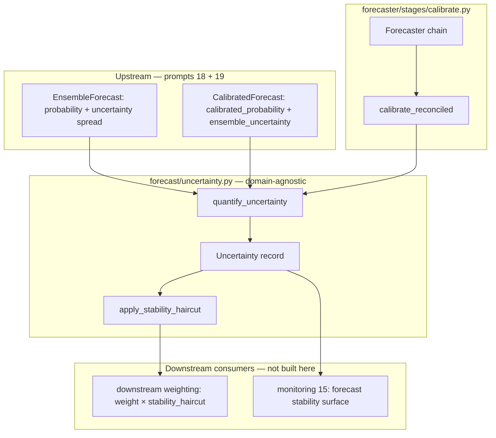

# Forecast Uncertainty Decomposition — Full Documentation

This document describes **every component** built in **Prompt 23** (uncertainty quantification for forecasts). For a one-page summary, see [DOCUMENTATION.md §15](DOCUMENTATION.md#15-uncertainty-decomposition-prompt-23). For the ensemble spread this module consumes, see [DOCUMENTATION.md §4](DOCUMENTATION.md#4-domain-agnostic-core-forecast) (prompt 18). For calibration inputs, see [DOCUMENTATION.md §13](DOCUMENTATION.md#13-calibration-prompt-19) (prompt 19).

Prompt 23 corrects a systematic blind spot: most forecasting systems quantify **event uncertainty** (how uncertain the outcome is given probability `p`) but ignore **LLM-output uncertainty** (how unstable the model is run-to-run). Ignoring the second source dramatically understates total variance. The ensemble spread from prompt 18 is the raw signal; this module decomposes both sources, combines them honestly, attaches a structured record to each forecast, and propagates the LLM-output piece to downstream consumers as a stability haircut and into monitoring (15).

Pipeline position in the full forecast stack:

```
agentic search (20) → ENSEMBLE (18) → SUPERVISOR (21) → calibrate (19) → quantify uncertainty (23) → downstream consumers
```

This document covers **uncertainty decomposition (23)** only. Ensemble aggregation, calibration, and Bayesian priors are separate prompts.

---

## Table of contents

1. [Mission and invariants](#1-mission-and-invariants)
2. [Architecture overview](#2-architecture-overview)
3. [Module map](#3-module-map)
4. [Mathematical reference](#4-mathematical-reference)
5. [Module reference (`forecast/uncertainty.py`)](#5-module-reference-forecastuncertaintypy)
6. [The `Uncertainty` object and provenance](#6-the-uncertainty-object-and-provenance)
7. [Configuration (`UncertaintyConfig`)](#7-configuration-uncertaintyconfig)
8. [Application integration (`forecaster/`)](#8-application-integration-forecaster)
9. [Monitoring integration (application layer)](#9-monitoring-integration-application-layer)
10. [Pipeline position and downstream hand-off](#10-pipeline-position-and-downstream-hand-off)
11. [End-to-end walkthrough](#11-end-to-end-walkthrough)
12. [Point-in-time contract](#12-point-in-time-contract)
13. [Testing: acceptance suite UQ1–UQ6](#13-testing-acceptance-suite-uq1u6)
14. [What still needs to be done](#14-what-still-needs-to-be-done)
15. [Known limitations and improvements](#15-known-limitations-and-improvements)

---

## 1. Mission and invariants

### What this layer is for

DELPHI forecasts are calibrated probabilities on binary events. After prompt 18 runs N independent LLM draws and aggregates them, and prompt 19 calibrates the aggregate, consumers of the forecast need an honest uncertainty band around the reported number. That band depends on **two distinct uncertainty sources**:

1. **Event-uncertainty** — inherent randomness of the binary outcome given probability `p`. A forecast near 0.5 is maximally uncertain about whether the event happens; a forecast near 0 or 1 is not.
2. **LLM-output uncertainty** — run-to-run instability of the model across independent ensemble passes. The ensemble spread (sample std of N raw probabilities) measures this.

These must **never be conflated**. A forecast can be confident about the event (`p` near 0/1) yet unstable across runs (high spread), or vice versa (`p` near 0.5 but tight consensus across runs).

This module:

- Computes both sources separately
- Combines them via variance addition into a `combined` field (derived, not a replacement)
- Derives a **stability haircut** from LLM-output uncertainty only — unstable forecasts get down-weighted, independent of event-uncertainty
- Surfaces the haircut to monitoring for operator visibility

### What this layer is NOT

| Forbidden pattern | Why |
|-------------------|-----|
| Rebuild the ensemble (18) | Spread is consumed, not recomputed |
| Rebuild calibration (19) | Uses calibrated probability when available; does not extremize |
| Rebuild downstream weighting logic | Exposes `apply_stability_haircut()`; how consumers use the adjusted value is out of scope |
| Fit haircut sensitivity on outcomes | Same anti-overfitting discipline as fixed √3 calibration |
| Conflate event and LLM-output into one number | Violates the core correction prompt 23 exists to make |
| Import application code in `forecast/` | Domain-agnostic core (CLAUDE.md §5) |

### Non-negotiable invariants

| Invariant | Meaning |
|-----------|---------|
| **Two distinct sources** | `event_uncertainty` and `llm_output_uncertainty` are always stored separately on `Uncertainty`. |
| **Spread passthrough** | `llm_output_uncertainty` equals the ensemble spread from prompt 18 — not IQR, not re-extremized. |
| **Haircut from LLM-output only** | `stability_haircut` depends only on `llm_output_uncertainty`, not on `p` or event-uncertainty. |
| **Deterministic** | Pure functions; no LLM, no network, no wall-clock reads. Same inputs → same outputs (UQ6). |
| **Monotone combination** | `combined` is strictly increasing in each source holding the other fixed (UQ4). |
| **Forecast layer only** | Never imports application layers or downstream consumers. |

---

## 2. Architecture overview

### Layer split (CLAUDE.md §5)

Uncertainty quantification lives in the **domain-agnostic core** (`forecast/uncertainty.py`). It depends only on:

- Plain floats (`probability`, `ensemble_spread`) for the core API
- `EnsembleForecast` / `CalibratedForecast` for thin adapters (optional convenience)
- `pydantic` for frozen config

Application wiring consumes it from the forecast chain's calibrate stage (`forecaster/stages/calibrate.py`), whose `calibrate_reconciled()` calls `quantify_from_calibrated()` after calibration. Dependency direction is **specialized → core** only.



### Data flow summary

| Stage | Input | Output |
|-------|-------|--------|
| Ensemble (18) | N LLM draws | `EnsembleForecast.probability`, `EnsembleForecast.uncertainty` (std) |
| Calibration (19) | Ensemble aggregate | `CalibratedForecast.calibrated_probability`, `CalibratedForecast.ensemble_uncertainty` (passthrough) |
| **Uncertainty (23)** | `(probability, ensemble_spread)` | `Uncertainty` with decomposed fields + `stability_haircut` |
| Downstream consumers | Raw weight + `Uncertainty` | `apply_stability_haircut(exposure, u)` |
| Monitoring (15) | `{name: stability_haircut}` | operator stability surface |

---

## 3. Module map

```
forecast/
├── uncertainty.py          # All uncertainty logic (this prompt)
├── ensemble.py             # Produces spread (prompt 18) — consumed, not modified
├── calibration.py          # Produces CalibratedForecast (prompt 19) — consumed via adapter
└── __init__.py             # Re-exports public API

forecaster/stages/
└── calibrate.py            # calibrate_reconciled() — recalibrate → extremize → quantify

tests/forecast/
└── test_uncertainty.py     # UQ1–UQ6 + §8 unit tests
```

### Public exports (from `forecast`)

```python
from forecast import (
    DEFAULT_HAIRCUT_SENSITIVITY,
    Uncertainty,
    UncertaintyConfig,
    apply_stability_haircut,
    combine_uncertainty,
    event_uncertainty,
    llm_output_uncertainty,
    quantify_from_calibrated,
    quantify_from_ensemble,
    quantify_uncertainty,
    stability_haircut,
)
```

Application layer:

```python
from forecaster.stages.calibrate import calibrate_reconciled
```

---

## 4. Mathematical reference

### 4.1 Event-uncertainty (Bernoulli standard deviation)

For a Bernoulli outcome with success probability `p`:

```
Var(X) = p · (1 − p)
event_uncertainty(p) = sqrt(p · (1 − p))
```

| p | event_uncertainty |
|---|-------------------|
| 0.50 | 0.500 |
| 0.70 | 0.458 |
| 0.90 | 0.300 |
| 0.99 | 0.100 |
| 0.999 | 0.032 |
| 0.0 or 1.0 | 0.000 |

**Rationale:** This is the canonical measure of how uncertain the *event* is given the forecast probability. It peaks at maximum entropy (p = 0.5) and vanishes at degenerate certainties. It does **not** capture model instability.

**Hard-to-reverse choice:** Bernoulli std was chosen over alternatives (entropy, `4·p·(1−p)` distance from 0/1) because it composes cleanly with variance addition and is directly interpretable for binary events.

### 4.2 LLM-output uncertainty (ensemble spread passthrough)

```
llm_output_uncertainty = ensemble_spread
```

Where `ensemble_spread` is the sample standard deviation (ddof=1) of the N raw pre-calibration probabilities from prompt 18 (`ensemble_std()` in `forecast/ensemble.py`).

**Rationale:** The robust aggregator (median / trimmed mean) already absorbs outliers in the point estimate. Std's job is to **expose** run-to-run disagreement for stability haircuts — not suppress it (IQR would). This field is passed through unchanged from calibration (19); it is not re-extremized.

### 4.3 Combined uncertainty (variance addition)

```
combined = sqrt(event_uncertainty² + llm_output_uncertainty²)
```

**Rationale:** Treats the two sources as independent variance contributions (law-of-total-variance flavor). Strictly monotone in each source. The `combined` field is **derived** for reporting and future use; it never replaces the two components in the record.

**Hard-to-reverse choice:** Variance addition vs. max(event, llm) vs. weighted sum. Addition is standard, interpretable, and monotone without arbitrary weights.

### 4.4 Stability haircut (stability multiplier)

```
stability_haircut = 1 / (1 + k · llm_output_uncertainty)
```

Where `k = DEFAULT_HAIRCUT_SENSITIVITY = 5.0`.

| spread | stability_haircut (k=5) |
|--------|-------------------------|
| 0.00 | 1.000 |
| 0.05 | 0.800 |
| 0.10 | 0.667 |
| 0.15 | 0.571 |
| 0.20 | 0.500 |
| 0.25 | 0.444 |

At spread ≈ 0.15 (calibration `DEFAULT_SPREAD_THRESHOLD`), haircut ≈ 0.57 — a meaningful but not catastrophic reduction.

**Properties:**

- Range: `(0, 1]` — never zeroes a forecast's weight by itself
- Monotone decreasing in spread
- **Independent of event-uncertainty** — varying `p` alone does not change the haircut (UQ3)
- Fixed `k` — never fit on outcome data

**Hard-to-reverse choice:** Reciprocal form vs. exponential decay vs. hard threshold. Reciprocal is smooth, bounded, and parameterizable with a single sensitivity constant.

Downstream consumers apply:

```
adjusted_exposure = apply_stability_haircut(raw_exposure, u)
                  = raw_exposure × u.stability_haircut
```

---

## 5. Module reference (`forecast/uncertainty.py`)

### Constants

#### `DEFAULT_HAIRCUT_SENSITIVITY = 5.0`

Fixed sensitivity for the reciprocal haircut. Chosen so spread ≈ 0.15 yields haircut ≈ 0.57. Not fitted on outcomes.

---

### `event_uncertainty(p: float) -> float`

Compute Bernoulli standard deviation for probability `p`.

**Contract:** `p` must be finite and in `[0, 1]`.

**Raises:** `ValueError` if `p` is out of range or non-finite.

**Examples:**

```python
event_uncertainty(0.5)   # 0.5
event_uncertainty(0.999) # ~0.032
event_uncertainty(0.0)   # 0.0
```

---

### `llm_output_uncertainty(ensemble_spread: float) -> float`

Passthrough of the ensemble spread from prompt 18.

**Contract:** `ensemble_spread` must be finite and non-negative.

**Raises:** `ValueError` if spread is negative or non-finite.

---

### `combine_uncertainty(event: float, llm: float) -> float`

Combine two non-negative uncertainty components via variance addition.

**Raises:** `ValueError` if either component is negative or non-finite.

---

### `stability_haircut(llm: float, *, config: UncertaintyConfig | None = None) -> float`

Compute the stability multiplier from LLM-output uncertainty only.

**Returns:** Value in `(0, 1]`. Returns `1.0` when `llm = 0`.

---

### `Uncertainty` (frozen dataclass)

Structured record attached to each forecast.

| Field | Type | Meaning |
|-------|------|---------|
| `event_uncertainty` | `float` | Bernoulli std from probability |
| `llm_output_uncertainty` | `float` | Ensemble spread (passthrough) |
| `combined` | `float` | `sqrt(event² + llm²)` |
| `stability_haircut` | `float` | Stability multiplier in `(0, 1]` |
| `provenance` | `Mapping[str, Any]` | Audit record (metrics, inputs, config) |

Both source fields are always populated separately. `combined` is derived.

---

### `quantify_uncertainty(probability, ensemble_spread, *, config=...) -> Uncertainty`

**Primary API.** Core entry point on plain floats — keeps `forecast/` free of application imports.

**Parameters:**

| Param | Source |
|-------|--------|
| `probability` | Ensemble aggregate or calibrated probability |
| `ensemble_spread` | `EnsembleForecast.uncertainty` or `CalibratedForecast.ensemble_uncertainty` |

**Returns:** Fully populated `Uncertainty` with provenance dict.

**Recommended pipeline position:** After calibration (19), use `calibrated_probability` + `ensemble_uncertainty`. Before calibration, use `quantify_from_ensemble()`.

---

### `quantify_from_ensemble(ensemble: EnsembleForecast, *, config=...) -> Uncertainty`

Adapter: `ensemble.probability` + `ensemble.uncertainty`.

Use when calibration (19) has not yet been applied.

---

### `quantify_from_calibrated(calibrated: CalibratedForecast, *, config=...) -> Uncertainty`

Adapter: `calibrated.calibrated_probability` + `calibrated.ensemble_uncertainty`.

**Recommended for downstream hand-off** — event-uncertainty reflects the calibrated point estimate; spread remains the raw ensemble disagreement.

---

### `apply_stability_haircut(exposure: float, uncertainty: Uncertainty) -> float`

Apply the LLM-output stability haircut to a downstream weight.

**Contract:** `exposure` must be finite. Returns `exposure × uncertainty.stability_haircut`.

**Raises:** `ValueError` if exposure is non-finite.

This is the function downstream consumers should call. What the adjusted value feeds — confidence-aware routing, reported bands, abstention policies — is out of scope for this module.

---

## 6. The `Uncertainty` object and provenance

Every call to `quantify_uncertainty()` (and adapters) attaches a provenance dict:

```python
{
    "probability": 0.72,
    "ensemble_spread": 0.12,
    "event_metric": "bernoulli_std",
    "llm_metric": "ensemble_spread_passthrough",
    "combination": "variance_addition",
    "haircut_form": "reciprocal",
    "haircut_sensitivity": 5.0,
}
```

**Purpose:** Reproducibility and registry audit. The provenance records which metrics and combination form were used without requiring a separate cache — uncertainty quantification is a pure deterministic transform (like calibration).

**Registry logging (not yet wired):** When forecasts flow through the experiment runner, log the full `Uncertainty` alongside the ensemble/calibrated forecast for post-hoc analysis of stability vs. outcome.

---

## 7. Configuration (`UncertaintyConfig`)

Frozen pydantic model for tunable parameters.

| Field | Default | Meaning |
|-------|---------|---------|
| `haircut_sensitivity` | `5.0` | Reciprocal form sensitivity `k` |

**Validation:** `haircut_sensitivity` must be finite and strictly positive.

**Usage:**

```python
from forecast import UncertaintyConfig, quantify_uncertainty

cfg = UncertaintyConfig(haircut_sensitivity=10.0)  # tighter haircut
u = quantify_uncertainty(0.6, 0.15, config=cfg)
```

Higher sensitivity → lower `stability_haircut` at the same spread.

**Not yet exposed:** Typed settings object at the orchestrator level (mirroring other pipeline settings). Today, config is passed at call time or defaults are used.

---

## 8. Application integration (`forecaster/`)

### `calibrate_reconciled(reconciled, ...) -> tuple[CalibratedForecast, Uncertainty]` (`forecaster/stages/calibrate.py`)

The forecast chain's calibrate + uncertainty stage wraps the prompt 23 contract:

```python
from forecaster.stages.calibrate import calibrate_reconciled

calibrated, u = calibrate_reconciled(reconciled)
# Recalibrates + extremizes reconciled.probability, then quantify_from_calibrated()
```

**Note:** the raw ensemble aggregate is **pre-calibration**. For production use, callers should:

1. Obtain `EnsembleForecast` from cache or `build_ensemble()`
2. Optionally run supervisor (21) and `calibrate_ensemble()` (19)
3. Call `quantify_from_calibrated(calibrated)` — **not** `quantify_from_ensemble()` on the raw aggregate

The `Forecaster` chain (`forecaster/chain.py`) wires this ordering end-to-end.

---

## 9. Monitoring integration (application layer)

Operator monitoring consumes a `forecast_stability` mapping:

```python
forecast_stability: Mapping[str, float]
```

Keys are caller-defined identifiers (e.g. question id or forecast fingerprint). Values are `stability_haircut` multipliers (1.0 = fully stable; lower = more unstable).

```python
forecast_stability = {
    "us_senate_2026_generic": 0.57,
    "product_launch_q3": 0.85,
}
```

When `forecast_stability` is non-empty, the operator dashboard renders a **Forecast stability** section with a caption explaining the multiplier semantics.

**Not yet wired:** Orchestration does not automatically populate `forecast_stability` from live forecasts. Callers must assemble the mapping from active forecasts and their latest `Uncertainty` records.

---

## 10. Pipeline position and downstream hand-off

### Recommended call order

```
1. ensemble = build_ensemble(draws, ...)           # prompt 18
2. reconciled = supervisor.reconcile(ensemble)    # prompt 21 (optional)
3. calibrated = calibrate_ensemble(ensemble)        # prompt 19
4. u = quantify_from_calibrated(calibrated)         # prompt 23 ← this module
5. adjusted = apply_stability_haircut(raw_weight, u)  # consumed downstream
```

### What downstream consumers receive

| Field | Source | Used for |
|-------|--------|----------|
| `calibrated.calibrated_probability` | Prompt 19 | Calibrated point estimate |
| `u.stability_haircut` | Prompt 23 | Multiply raw weight — unstable forecasts down-weighted |
| `u.llm_output_uncertainty` | Prompt 23 | Monitoring, diagnostics, optional abstention thresholds |
| `u.event_uncertainty` | Prompt 23 | Reporting; does **not** drive the haircut |
| `calibrated.near_decision_boundary` | Prompt 19 | Optional additional abstention signal (independent) |

### What downstream consumers must NOT do

- Re-derive event or LLM-output uncertainty from scratch — use `quantify_from_calibrated()`
- Apply a second haircut formula — `stability_haircut` is the canonical multiplier
- Use `combined` as the haircut input — it conflates sources; haircut is LLM-output only
- Fit `haircut_sensitivity` on realized outcomes

### What this module does NOT do (by design)

- Decide how downstream consumers use the adjusted value — that wiring is the application's task
- Generate alerts on high instability — monitoring surfaces values; alert policy is deferred

---

## 11. End-to-end walkthrough

### Domain-agnostic path (recommended)

```python
from datetime import UTC, datetime

from forecast import (
    FixtureForecastLLM,
    apply_stability_haircut,
    build_ensemble,
    calibrate_ensemble,
    quantify_from_calibrated,
)
from forecast.llm import ForecastDraw

# 1. Build ensemble (normally via the Forecaster chain + cache)
draws = tuple(
    ForecastDraw(
        probability=p,
        run_index=i,
        model_version="fixture",
        prompt_version="v1",
        provenance={"run_index": i},
    )
    for i, p in enumerate([0.55, 0.62, 0.58, 0.61, 0.59, 0.57, 0.60, 0.56, 0.63, 0.54])
)
ensemble = build_ensemble(
    draws,
    aggregator="median",
    knowledge_time=datetime(2024, 6, 1, tzinfo=UTC),
)
# ensemble.uncertainty ≈ 0.028 (sample std of draws)

# 2. Calibrate once
calibrated = calibrate_ensemble(ensemble)

# 3. Decompose uncertainty
u = quantify_from_calibrated(calibrated)
print(f"event={u.event_uncertainty:.3f}")       # Bernoulli std of calibrated p
print(f"llm={u.llm_output_uncertainty:.3f}")   # ensemble spread (unchanged)
print(f"combined={u.combined:.3f}")
print(f"haircut={u.stability_haircut:.3f}")

# 4. Apply to a downstream weight
raw_exposure = 0.08  # weight before stability adjustment
adjusted_exposure = apply_stability_haircut(raw_exposure, u)
print(f"adjusted={adjusted_exposure:.4f}")
```

### Application path

```python
from forecaster.chain import Forecaster

result = forecaster.forecast(question, as_of=as_of)
u = result.uncertainty  # quantified from the calibrated forecast
```

### Monitoring path

```python
stability_map = {
    f"{forecast.content_hash[:8]}": u.stability_haircut
    for forecast, u in active_forecasts
}
# hand stability_map to the operator monitoring surface
```

---

## 12. Point-in-time contract

Uncertainty quantification is **PIT-neutral**:

- Inputs are `(probability, ensemble_spread)` — both are pure statistics over PIT-correct ensemble runs from prompt 18
- No additional data access, no clock reads, no network calls
- The transform introduces no look-ahead beyond what the ensemble already encodes

**Leakage test implication:** Adding future ensemble runs would change the spread (an ensemble-layer concern). The uncertainty transform itself does not read future rows.

**When using calibrated inputs:** `calibrated_probability` inherits the PIT contract from the upstream ensemble. `ensemble_uncertainty` is the raw pre-calibration spread — still valid as a disagreement measure because all N runs were as-of `knowledge_time`.

---

## 13. Testing: acceptance suite UQ1–UQ6

```bash
uv run pytest tests/forecast/test_uncertainty.py -v
```

### UQ1 — Decomposition (critical)

A forecast confident about the event (`p ≈ 0.999`) with high spread (`0.25`) shows **low event-uncertainty** and **high LLM-output uncertainty** — not conflated.

### UQ2 — LLM-output from spread

High ensemble spread → high `llm_output_uncertainty`; low spread → low. Zero spread → zero LLM-output uncertainty and `stability_haircut = 1.0`.

### UQ3 — Stability haircut (critical)

Higher LLM-output uncertainty reduces `apply_stability_haircut()` output. Varying `p` alone at fixed spread does **not** change `stability_haircut`.

### UQ4 — Combination monotone

`combined` strictly increases when either source increases holding the other fixed.

### UQ5 — Monitoring surface

`stability_haircut` values are surfaced per forecast to the operator monitoring layer (application-level).

### UQ6 — Determinism

Identical `(probability, ensemble_spread, config)` → identical `Uncertainty` objects.

### §8 unit tests

Per-public-function happy / boundary / failure coverage:

| Function | Happy | Boundary | Failure |
|----------|-------|----------|---------|
| `event_uncertainty` | p=0.5 → 0.5 | p∈{0,1} → 0 | p out of range raises |
| `quantify_uncertainty` | full record + provenance | zero spread | negative spread, invalid p raise |
| `apply_stability_haircut` | exposure × haircut | — | NaN exposure raises |
| `UncertaintyConfig` | default k=5 | — | k≤0 raises |

---

## 14. What still needs to be done

### P0 — Required for production use

| Item | Status | Work required |
|------|--------|---------------|
| **Wire haircut into downstream consumers** | Not wired | After `quantify_from_calibrated()`, multiply the forecast's downstream weight by `stability_haircut`. Requires orchestration to chain calibrate → quantify → hand off. |
| **Orchestrator hook** | Not wired | Prompt 16 orchestrator should call `quantify_from_calibrated()` after calibration, pass `Uncertainty` to downstream consumers, and populate `forecast_stability` for monitoring. |
| **Use calibrated path consistently** | Partial | The raw ensemble aggregate is pre-calibration. Production must call `calibrate_ensemble()` then `quantify_from_calibrated()` — not quantify the raw aggregate. |
| **End-to-end pipeline test** | Not written | Integration test: ensemble → calibrate → quantify → assert decomposition + haircut monotonicity. |
| **Registry logging** | Not implemented | Log full `Uncertainty` + provenance to experiment registry alongside forecast artifacts. |

### P1 — Infrastructure and ergonomics

| Item | Status | Work required |
|------|--------|---------------|
| **One-call `calibrated_forecast()` wrapper** | Not built | One-call ensemble + calibration + uncertainty for the application layer (mirrors gap noted for supervisor). |
| **`quantify_from_reconciled()` adapter** | Not built | After supervisor (21), quantify using `reconciled.probability` + original ensemble spread. |
| **Typed settings for `UncertaintyConfig`** | Not exposed | Operator-level pydantic settings instead of per-call kwargs only. |
| **Monitoring loop populates `forecast_stability`** | Not wired | Orchestration monitoring loop should map active forecasts → latest `stability_haircut`. |
| **Per-domain uncertainty rollups** | Not built | Today stability is surfaced per forecast; per-domain reporting may need nested snapshots. |

### P2 — Observability and ops

| Item | Status | Work required |
|------|--------|---------------|
| **Instability distribution dashboard** | Partial | `forecast_stability` renders in Streamlit when populated; no historical trend store or alert on high instability. |
| **Alert on extreme instability** | Not implemented | Optional `AlertKind.FORECAST_INSTABILITY` when `stability_haircut` below threshold — policy decision deferred. |
| **Spread vs. haircut monitoring** | Not implemented | Track relationship between raw spread and adjusted weight over time; detect threshold miscalibration. |
| **Config lock file** | Not implemented | `UncertaintyConfig` changes aren't gated by a lock file. |

### P3 — Future prompts and research

| Item | Prompt | Notes |
|------|--------|-------|
| Bayesian posterior uncertainty | 24 | May add a third source (prior uncertainty); this module's two-source split remains the LLM/event foundation |
| Leakage judge on uncertainty provenance | 22 | Audit that spread inputs came from PIT-correct ensemble cache |
| Empirical haircut validation | Research | Compare haircut-adjusted vs. unadjusted proper scores stratified by spread quartile — validate k=5.0 without fitting on the same sample used for promotion |

### Checklist: minimum viable uncertainty in production

- [ ] Chain `calibrate_ensemble()` → `quantify_from_calibrated()` in orchestration forecast path
- [ ] Multiply the forecast's downstream weight by `stability_haircut` before hand-off
- [ ] Pass `{forecast_id: stability_haircut}` to the monitoring surface
- [ ] Log `Uncertainty` provenance to registry on each forecast cycle
- [ ] Add end-to-end test proving unstable fixture gets a smaller adjusted weight than stable fixture at same `p`

---

## 15. Known limitations and improvements

### Current limitations

1. **Haircut not wired downstream** — `apply_stability_haircut()` exists but no downstream consumer calls it yet. Behavior is unchanged until orchestration wires the multiplier.

2. **Quantifying the raw aggregate uses a pre-calibration probability** — callers using `quantify_from_ensemble()` get event-uncertainty from uncalibrated `p`. Use `quantify_from_calibrated()` for production.

3. **No supervisor adapter** — After reconciliation (21), probability changes but spread is still from the original ensemble. A dedicated `quantify_from_reconciled(reconciled, ensemble)` helper would clarify which probability to use.

4. **Fixed haircut sensitivity** — `k=5.0` is chosen heuristically to align with calibration spread threshold. No empirical validation yet. Changing it requires code or call-site config — not operator settings.

5. **No uncertainty cache** — Unlike ensemble and reconciliation caches, uncertainty is recomputed on every call. Cheap (pure math) so not blocking, but registry persistence is still missing.

6. **Monitoring is display-only** — `forecast_stability` surfaces haircuts but does not trigger alerts, affect downstream weighting, or persist history.

7. **`combined` is not consumed downstream yet** — Reserved for reporting and future uncertainty models. Downstream adjustment uses `stability_haircut` only; do not substitute `combined`.

8. **Single spread metric** — Only ensemble std (prompt 18) is supported. IQR or supervisor disagreement metrics are not integrated as alternate LLM-output signals.

9. **No per-run uncertainty decomposition** — Individual `ForecastDraw` probabilities are not decomposed; only the aggregate + spread pair is quantified.

10. **Event-uncertainty uses point estimate only** — Does not propagate calibration extremization uncertainty or Bayesian posterior width (prompt 24).

### Recommended improvements

| Priority | Improvement | Rationale |
|----------|-------------|-----------|
| **P0** | Wire `apply_stability_haircut` into the orchestration hand-off | Realizes the core prompt 23 correction in the production path |
| **P0** | End-to-end integration test | Proves pipeline before production |
| **P1** | `calibrated_forecast()` + quantify one-call application wrapper | Prevents accidental pre-calibration quantification |
| **P1** | `quantify_from_reconciled()` adapter | Clean hand-off after supervisor |
| **P1** | Registry logging of `Uncertainty` | Audit trail for stability vs. outcomes |
| **P2** | Typed `UncertaintyConfig` in orchestrator settings | Operator control without code changes |
| **P2** | Instability alert threshold | Surface extreme spread in monitoring alerts |
| **P2** | Historical `forecast_stability` snapshots | Trend model instability over time |
| **P3** | Empirical review of k=5.0 | Validate haircut severity out-of-sample without fitting on promotion data |
| **P3** | Optional IQR as diagnostic (not a haircut input) | Logged for analysis; std remains canonical for haircut |

### Anti-patterns to avoid

- Do not conflate `event_uncertainty` and `llm_output_uncertainty` into a single downstream input — the whole point of prompt 23 is keeping them distinct.
- Do not use `combined` as the haircut multiplier — it mixes event uncertainty into the stability adjustment incorrectly.
- Do not fit `haircut_sensitivity` on realized outcomes — same overfitting discipline as calibration α.
- Do not recompute spread inside this module — consume prompt 18's `ensemble_std` passthrough.
- Do not import application code into `forecast/uncertainty.py` — breaks the domain-agnostic core (§5).
- Do not skip quantification for "stable-looking" forecasts — zero spread is handled (`haircut=1.0`); absent quantification loses audit trail.

---

## Quick reference

```bash
# Run uncertainty tests
uv run pytest tests/forecast/test_uncertainty.py -v

# Full forecast package
uv run pytest tests/forecast/ -v

# Gates
uv run pyright && uv run ruff check .
```

**Minimal production pattern:**

```python
from forecast import calibrate_ensemble, quantify_from_calibrated, apply_stability_haircut

calibrated = calibrate_ensemble(ensemble)
u = quantify_from_calibrated(calibrated)
adjusted_exposure = apply_stability_haircut(raw_exposure, u)
```
